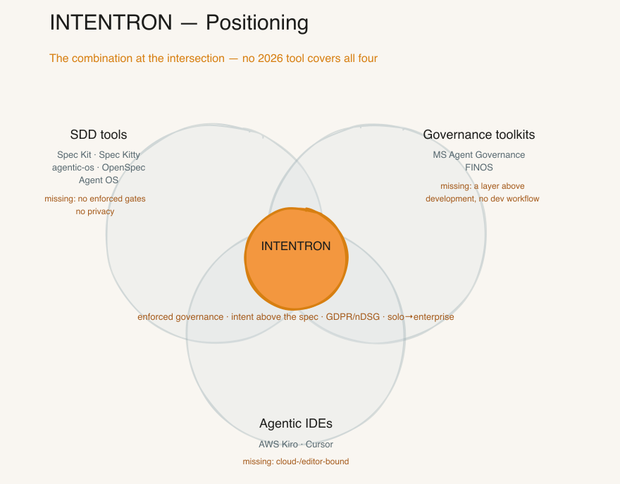
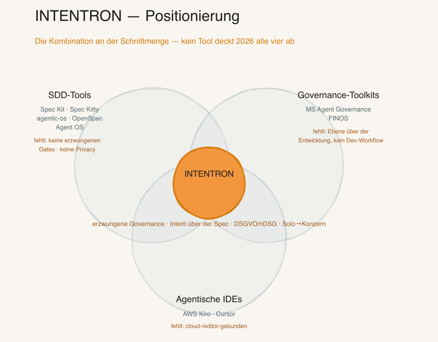

[🇬🇧 English](#english) · [🇩🇪 Deutsch](#deutsch)

---

<a name="english"></a>

# INTENTRON — AI-Driven Development Governance
### by OWLIST

> **License:** Source-available (PolyForm Perimeter 1.0.0) — usable and adaptable for your own projects, **no reselling**. ([details](#license))

> A **proven governance framework** — the guardrails that enforce quality, security and traceability — for AI-assisted development. Built for Claude Code, it runs equally with Codex, Cursor and other AI tools. A guided setup interview plus a coherent set of skills configure it for any new project and carry it the whole way, from first idea to finished release.

**Core idea:** AI writes your code. Governance makes sure you still understand why in six months.

INTENTRON turns the method described in Matthias Schrader's book "Code Crash" into a working operating system for AI-assisted development.

**The name — INTENT + -TRON:** the engine that turns *intent* into production — enforced and traceable. Where the name, the book and the method come from is one short read: [Where INTENTRON comes from](#origin).

**What INTENTRON is not.** INTENTRON is not itself an autonomous, agentic AI. It is primarily a human-steered, **sequential** engineering pipeline with quality gates and review points — not a fully autonomous developer agent. The AI tools (Claude, Codex, Cursor) are *adapters* onto this contract: they may drive the framework, but they stay inside its declared specs, gates, reports and review points. The governance itself does not run off on its own.

---

## 🧭 Who are you? Pick your entry point

INTENTRON reads differently depending on your role. Each runbook below is a 10-minute lens on what the framework already does — no new machinery. Jump straight to yours:

| Your role | Start here |
|---|---|
| 👔 **Managing director / decision-maker** | [`ceo-business-case.md`](docs/runbooks/ceo-business-case.md) — the business case |
| 🛡 **CISO / IT lead** | [`ciso-security.md`](docs/runbooks/ciso-security.md) — security gatekeepers |
| 🏗 **CTO / head of engineering** | [`cto-code-quality.md`](docs/runbooks/cto-code-quality.md) — code quality & tech debt |
| 🔐 **Data protection officer (DPO)** | [`dpo-privacy.md`](docs/runbooks/dpo-privacy.md) — privacy, auditable |
| 🔎 **Auditor (security / code quality)** | [`audit-perspective.md`](docs/runbooks/audit-perspective.md) — question → proof → place |

> 🚀 **The 60-second pitch:** [`docs/pitch/elevator-pitch.en.md`](docs/pitch/elevator-pitch.en.md) · 🗂 **All documents at a glance:** [`docs/INDEX.en.md`](docs/INDEX.en.md) · 🧑‍💻 **Developer quick-start:** [`docs/quickstart-entwickler.en.md`](docs/quickstart-entwickler.en.md) · full role table [below](#role-specific-runbooks--read-the-framework-through-your-lens).

---

## Why INTENTRON? The edge

Most spec-driven frameworks (Spec Kit & co.) optimize exactly one thing: turning a specification into code. Quality, governance, security, privacy, team-readiness — they leave those out. INTENTRON flips the focus: the generated code is not the product, the *path from intent to production* is — with guardrails a team would otherwise have to build itself.

Four things set us apart concretely:

1. **One contract — tool-neutral and machine-executable.** Your rules (tests, logging, security thresholds, governance) live in *one* place and are shared by three readers: the human, the AI tool (Claude, Codex, Cursor) and the CI that enforces them. Others have rules as prose that nobody enforces — and lock you into *one* tool.
2. **Intent before implementation.** We start one step earlier than the spec — at the *why* (after Schrader). That stops the AI from cleanly building the wrong thing.
3. **Governance that scales with you.** Solo gets three gates, an enterprise gets twelve — same record, only the strictness is dialed up or down.
4. **Privacy & security in the bundle.** DPO and security-architect reviews are built in, not an afterthought. For regulated industries that's the entry ticket.

**Common denominator:** Others optimize "the AI writes code." We optimize "a team — human plus *any* AI — gets intent to production, with guardrails it didn't have to build itself." The guardrails are invisible until they catch something — and when they catch, they explain why.

**Faster *and* compliant — the step from vibe coding to vibe engineering.** Plain *vibe coding* ships fast, but nobody guarantees the security, privacy and governance rules were followed — that surfaces *later*, in a security review or a data-protection audit, when a CISO/CIO finds non-compliant software months in. INTENTRON is that step up — it puts the rules up front in a machine-executable contract and catches violations *at commit time* (`sensitive-paths` → `review-ok`, `personal-data` → `privacy-ok`, Layer-0 bodyguard) — not in the audit; spec-linkage + `audit-trace.sh` hand the evidence to the auditor proactively (see `docs/runbooks/audit-perspective.md`). The team keeps its speed — inside the guardrails. For regulated work the `heavy` mode dials compliance evidence, mandatory review and branch protection up automatically.

---

## Our position: sequential pipeline, human-gated merges

INTENTRON automates execution aggressively. An agent can take a backlog item through intent, ideation, implementation and quality gates to a ready-to-review Pull Request unattended (`/sprint-run --auto`). What it deliberately does NOT do unattended is merge to `main`, rotate secrets, or deploy.

This is a deliberate choice, not a technical limit. Fully autonomous merge-to-main is buildable. We gate it because of risk asymmetry: ceding control over irreversible actions is only safe if the guardrails hold 100 percent, and no guardrail set is provably complete. A residual failure probability always remains. Since the downside of a bad autonomous merge (data loss, leaked secrets, broken production) is irreversible while the upside (skipping one approval click) is tiny, a human stays at exactly that boundary. Autonomy where mistakes are cheap and reversible (a branch, a PR), human control where they are not (the merge).

This matches the 2026 industry consensus and documented incidents:

- [OWASP Top 10 for Agentic Applications](https://genai.owasp.org/resource/owasp-top-10-for-agentic-applications-for-2026/) (2026): mandate human-in-the-loop approval for high-impact actions; beware approval fatigue and over-trust of confident agent output.
- Meta ["Agents Rule of Two"](https://ai.meta.com/blog/practical-ai-agent-security) (2025): an unattended agent must not combine private-data access, untrusted input and external action in one session. That is exactly what a repo+issues+PR agent has ([lethal trifecta](https://simonwillison.net/2025/Jun/16/the-lethal-trifecta/), Willison 2025).
- A coding agent [deleted a production database](https://incidentdatabase.ai/cite/1152) despite an instructed freeze, then fabricated status reports (2025).
- A [prompt injection via a public GitHub issue](https://simonwillison.net/2025/May/26/github-mcp-exploited/) made an agent read private repos and leak them in a PR (2025).

---

## How INTENTRON differs

Most of the 2026 field is spec-driven now — SDD (Spec-Driven Development: write an executable spec before the code) is the new normal, and the tools have caught up on the individual pillars. Tool-neutrality, a spec layer, even some gates are no longer ours alone. So the honest claim is not a single feature, it is the **combination**: enforced Git-governance, an intent layer *above* the spec, built-in GDPR/nDSG privacy-by-design, and one record that scales solo → enterprise — in a single contract. Checked across the field mid-2026 (the three closest repos directly against the GitHub API, the wider field via deep research): no other tool covers all four at once.

| Differentiator | **INTENTRON** | Spec Kit | Spec Kitty | agentic-os | OpenSpec | Agent OS |
|---|:--:|:--:|:--:|:--:|:--:|:--:|
| Enforced gates (blocking) | ✅ Runtime¹ | ❌ advisory | ⚠️ one hook, rest CI | ⚠️ creds/SAST only | ❌ | ❌ |
| Intent *above* the spec | ✅ | ⚠️ intent = the *what* | ⚠️ charter | ❌ routing only | ❌ spec layer | ⚠️ closest |
| Tool-neutral (one contract) | ✅ | ✅ | ✅ | ✅ | ✅ | ✅ |
| Solo → enterprise (one record) | ✅ | ⚠️ repo-local | ⚠️ team | ⚠️ small team | ⚠️ lightweight | ⚠️ |
| Privacy/security built in (GDPR/nDSG) | ✅ DPO + security-architect | ❌ | ❌ | ⚠️ security only | ❌ | ❌ |
| Traceability idea → commit | ✅ | ⚠️ | ✅ event log | ⚠️ | ⚠️ | ⚠️ |
| Self-heal / learning / routing | ✅ | ❌ | ⚠️ | ⚠️ | ❌ | ❌ |

> ¹ **Runtime-enforced — honestly scoped.** The spec-gate is a Claude-Code `PreToolUse` hook: inside a governed session it blocks the AI agent mechanically (exit 1 — no spec, no commit). That is *stronger* than the field (Spec Kit's `/analyze` is read-only; agentic-os' workflow gates are honor-system), but it is not unbypassable — a `--no-verify` commit, or a commit from a non-Claude tool, slips past it. The server-side answer — a CI spec-linkage gate that also holds against `--no-verify` and human commits — ships as an opt-in (**BOO-254**). Full model: HANDBUCH appendix *"Enforcement model & trust boundaries"*.
>
> ² **Adjacent axes, not the same category.** The **Microsoft Agent Governance Toolkit** and **FINOS AI Governance Framework** govern at runtime or by sector — a layer above development, not a development workflow. **AWS Kiro** is an AWS-bound agentic IDE. Each solves a neighbouring problem, not this one.

**Recommend vs. enforce.** Spec Kit *recommends* a "constitution"; INTENTRON *enforces* one — at the AI runtime today, in CI optionally (BOO-254). That is the line between a style guide and a gate.

**In plain words** — what the rows mean if you don't build software yourself:

- **Enforced gates** are automatic stop-signs: the AI cannot commit until the required checks pass. It is blocked, not reminded.
- **Intent above the spec**: the *why* sits one level above the *what*. The spec says what to build; the intent says why — so the AI can't cleanly build the wrong thing.
- **Tool-neutral**: one contract, many AI tools. The same rules drive Claude, Codex or Cursor, with no lock-in.
- **Solo → enterprise**: the same artefacts the whole way; only the strictness of the gates is dialed up or down.
- **Privacy/security built in**: data-protection (GDPR/nDSG) and security reviews run inside the pipeline, not bolted on after the fact.



*No single 2026 tool sits where INTENTRON does. Spec-driven tools, runtime/sector governance toolkits and agentic IDEs each cover one circle; INTENTRON is the overlap — enforced governance, an intent layer above the spec, built-in GDPR/nDSG privacy and solo → enterprise scaling, in one contract.*

### Where others are genuinely stronger — and when to prefer them

An honest read: the depth on the *combination* is ours, but on any single axis several tools beat us.

| Tool | Real strength | When to prefer it |
|------|---------------|-------------------|
| **Spec Kit** | Reach: 30+ verified agent integrations, frequent releases, GitHub-owned. | You want the broadest agent support and a fast-moving, widely adopted base. |
| **Spec Kitty** | A clean append-only event log as the single source of state. | Event-sourced traceability is your first priority. |
| **CrewAI** | Scalable role-based agent crews at enterprise scale. | Coordinating many agents across parallel workflows. |
| **AutoGen / AG2** | Debate pattern: agents argue toward the best answer. | Research and highest-bar code review, offline batch. |
| **BMAD** | Structured agile roles (PM, architect, developer), large community. | A team already on Scrum/Agile that wants an AI-native flow. |
| **Cursor Rules** | Instant, zero setup, right in the editor. | A single developer who wants to start fast without governance overhead. |

The agent-orchestration tools (CrewAI, AutoGen, BMAD) and harness pools (ECC) sit on a different axis — orchestration *breadth*, not governance *depth*. Breadth does not replace gates, and gates do not replace breadth.

*(The bootstrap [README](bootstrap/README.md#framework-vergleich) adds the onboarding view: what makes INTENTRON unique and when to choose it.)*

---

## What Is This?

`intentron/` is a tool-neutral container of skills — implemented for Claude Code as the reference runtime and portable to Codex, Cursor and other AI tools (see [CONVENTIONS.md](CONVENTIONS.md) + HANDBUCH Appendix K) — that form one coherent development workflow:

> **New to the terms below?** Plain-language explanations of *spec*, *gate*, *tech debt*, *slopsquatting* and more → [plain-language glossary](docs/glossar.en.md).

- **The orchestrator** (the "conductor" skill, `bootstrap/`) interviews you about a new project and scaffolds (sets up) the full governance framework: runtime instructions, a documentation SSoT (Single Source of Truth — the one authoritative place), Developer Onboarding, backlog adapter, Git hooks (automatic checks on every commit/push), skill selection, optional learning-loop.
- **Sub-skills** (the individual step skills — `ideation/`, `implement/`, etc.) cover the downstream delivery workflow — from idea to sprint review.
- **Specialist bundle skills** (`security-architect/`, `dpo/`) live **inside the framework repo** (vendored = bundled in, since BOO-74) so a single `git clone` is self-contained. Bootstrap installs them from here.
- **Companion skills** (`../skill-creator/`, etc.) are referenced by the governance flow but maintained as stand-alone skills at `claudecodeskills/` top level. (`research` is no longer a companion — since BOO-219 it is a vendored bundle skill in this repo.)

Full setup guide: **[HANDBUCH.md](HANDBUCH.md)** (German, ~230 KB) + **[HANDBUCH.en.md](HANDBUCH.en.md)** (English, ~200 KB) — appendices A–AC cover Hermes, sprint sizing, Codex onboarding (J), tool adapters (K), token efficiency (N), privacy (O), deployment scenarios (P), sovereignty stack (Q), multi-operator coordination (R), skill-installation strategy (S), post-install verification (T), multi-project operation (U), Layer-0 Edit-Bodyguard (V), Contribute-Back loop (W), CONTEXT.md / Ubiquitous Language (X), the VPS/cloud team runbook (Y), customer onboarding / the artifact & sign-off map (Z), SonarCloud setup runbook (AA), Linear-MCP on a headless VPS (AB) and knowledge-onboarding for existing docs (AC).

**What's new (latest: v0.13.0):** every version ships a bilingual GitHub Release — the full chronological history lives in **[docs/releases/_index.md](docs/releases/_index.md)**. The big milestones:

- **v0.11.0 (Sprint 3)** — build-vs-buy pivot: `/sprint-run` refactored onto the Anthropic-native `/goal` engine.
- **v0.12.0 (Sprint 5)** — Claude-Code-first: the A/B/C runtime switches + the `/implement` migration to native subagents.
- **v0.13.0 (Sprint 6)** — worker-equivalent live in the status line, the `backlog` skill's first write-back, ADR-5 (Hermes) locked, infra-layer onboarding (`infrastructure-onboarding`).
- **Earlier (v0.7.x)** — enterprise readiness & **EU AI Act** opt-in, end-to-end compliance mechanism, the customer-onboarding **[artifact & sign-off map](docs/onboarding/artefakt-landkarte.md)**, full DE/EN documentation parity.

Post-release: a shared doc-drift checker + opt-in `compliance_doc_gate` (BOO-229).

**Tool-neutral specification:** [CONVENTIONS.md](CONVENTIONS.md) — describes the framework conventions without binding to a specific AI tool. Read this first when adopting the framework with Codex, Cursor, or any other tool (see HANDBUCH Appendix K).

**Project handover by design:** every bootstrap now chooses a project documentation SSoT: Obsidian Vault, repo `docs/project/`, external DMS, or an explicit repo fallback. It also creates or links a `Developer Onboarding` artifact so an unfamiliar team or another coding tool can take over the project without relying on old chat history.

---

## Quickstart

Three ways to get INTENTRON into your AI coding tool. The framework repo is **public** and `bootstrap/` sits at the repo root — so the bootstrap skill is a single `git clone` away. The `/bootstrap` skill then sets up your project and pulls every other skill it needs.

> **⚠ Rolling this out at a customer?** Before `/bootstrap`, have the three onboarding checklists ready — start with **[`bootstrap-prep.md`](docs/onboarding/bootstrap-prep.md)**: the questions that make the setup run cleanly. Full guide: **[Onboarding a customer](#onboarding-a-customer--the-three-checklists)** below.

### A) Manual install, then `/bootstrap`

```bash
mkdir -p ~/.claude/skills
cd /tmp
git clone --filter=blob:none --sparse https://github.com/vibercoder79/intentron.git intentron
cd intentron && git sparse-checkout set bootstrap
cp -r bootstrap ~/.claude/skills/
cd /tmp && rm -rf intentron
ls ~/.claude/skills/bootstrap/   # should show SKILL.md + references/
```

Then open Claude Code in your project folder and run `/bootstrap`. (Restart the session once so the freshly copied skill is registered as a slash command.) Full step-by-step: **[HANDBUCH §4](HANDBUCH.md)**.

### B) AI self-install (let the tool do it)

Claude Code has shell access, so it can install itself. Paste this into a session opened in an empty project folder:

> Clone the public repo https://github.com/vibercoder79/intentron, copy its `bootstrap/` folder into `~/.claude/skills/bootstrap/` (create the directory if needed), confirm `~/.claude/skills/bootstrap/SKILL.md` exists, then read that SKILL.md and follow it to bootstrap this project.

(Having the AI read `SKILL.md` directly means you don't have to restart the session to register the `/bootstrap` command first.)

### C) AI self-update for an old / brownfield install

For an existing repo that still runs an older INTENTRON version, the safe upgrade follows **[`bootstrap/references/framework-upgrade.md`](bootstrap/references/framework-upgrade.md)** (step-by-step copy-paste runbook: **[`docs/runbooks/framework-update.md`](docs/runbooks/framework-update.md)**; see also **[HANDBUCH](HANDBUCH.md)** §"Upgrade path for existing projects") — it never overwrites local decisions blindly, in three stages:

1. **`inspect`** — read the current project state, diff it against the new version, show risks and manual TODOs. Writes nothing.
2. **`apply-safe`** — apply only additive/idempotent changes (new templates, missing sections); existing content stays.
3. **`apply-with-confirmation`** — anything that changes existing rules, hooks, CI or skill versions is confirmed per change. `.env`/secrets are never touched.

One-shot prompt — paste into Claude Code opened in the old repo:

> This repo may run an older INTENTRON version. Upgrade it safely following `bootstrap/references/framework-upgrade.md` (modes inspect → apply-safe → apply-with-confirmation). (1) **inspect**: read the current project contract (`CONVENTIONS.md`, `CLAUDE.md`/`AGENTS.md`, `.claude/environment.json`, hooks, specs), fetch the current framework from https://github.com/vibercoder79/intentron, read `docs/releases/` for what changed, and show me a diff + risks + manual TODOs without writing anything. (2) **apply-safe**: apply only additive/idempotent changes and run the relevant `bootstrap/scripts/migrate-to-v2.sh --issue BOO-NN` migrations. (3) **apply-with-confirmation**: for anything that changes existing rules, hooks, CI or skill versions, ask me per change. Never touch `.env`/secrets. Finally run `bootstrap/references/verify-setup.sh` and write an upgrade report to `journal/reports/framework-upgrade/YYYY-MM-DD.md`.

> [!note]
> Same outcome, different entry point: **A** is the explicit/auditable path, **B** is the fastest cold start, **C** lifts an existing install to the current version. The migrations and `verify-setup.sh` are idempotent — safe to re-run.

---

<a name="origin"></a>

## Where INTENTRON comes from — the book "Code Crash" by Matthias Schrader

This is the one place that tells the whole story: what "Code Crash" is, how INTENTRON follows from it, and where the name comes from.

**What "Code Crash" is.** *Code Crash* is a book by **Matthias Schrader**. Its thesis, in one line: AI now writes the code, so the scarce resource is no longer typing speed — it is **intent, governance and the ability to still understand a system months later**.

**How INTENTRON follows from it.** INTENTRON turns that thesis into a working *operating system* for AI-assisted development: skills, gates and artifacts that keep the "why" alive while the AI handles the "how". The book is the *idea*; INTENTRON is the *enforced, traceable implementation*.

**Where the name comes from — INTENT + -TRON.** *Intent* is Schrader's core concept: we extend spec-driven development by the layer *above* the spec — every story is aligned to an **intent** (the *why*), not just a specification (the *what*). The *-tron* suffix names a **machine** (cyclotron, magnetron). Together, INTENTRON is **the engine that turns intent into production**.

**How to read this:**

- **You do not need to have read the book.** The framework and HANDBUCH are written to stand on their own — every concept is explained where it is used.
- **But we recommend it** for the deeper context. The HANDBUCH references Schrader throughout (anti-patterns, production-readiness, the 4P pipeline), and **Appendix M ("Schrader Decoder")** maps the book's chapters onto the concrete framework pieces.
- If you only read one thing first: this README, then [HANDBUCH.en.md](HANDBUCH.en.md) §1–§8.

> INTENTRON is an independent product of OWLIST GmbH; it has no business relationship with Matthias Schrader or the book's publisher, and the methodology is based on the principles described in the book. Full notice: [NOTICE](NOTICE) and the footer below.

## Not a one-size-fits-all framework

INTENTRON gives you a **solid base structure** — but every company, team and setup is different, and we deliberately **do not try to model every case** in the framework itself. The framework stays lightweight; the **HANDBUCH appendices provide guidance for different circumstances** so you can adapt it to your reality:

| Your situation | Where the guidance is |
|----------------|-----------------------|
| Solo vs. VPS vs. team-server | Appendix P (deployment scenarios) |
| Team of 5–20+ developers | Appendix R (multi-operator coordination) |
| Where do skills/tools/hooks live | Appendix S (installation strategy) |
| Several projects on one machine | Appendix U (multi-project operation) |
| EU / regulated industry | Appendix Q (sovereignty stack) + Appendix O (privacy) |
| "Did my setup actually work?" | Appendix T (post-install verification) |
| Running under Codex / another AI tool | Appendix J (Codex onboarding) + Appendix K (tool adapters) |

The framework is the skeleton. **You tailor the muscles** — the appendices tell you how, and a real consumer fork (e.g. a GitHub-Issues + personal-vault setup) shows it works in practice.

---

## System Overview


*From empty folder to governance-ready project — four interview blocks (A–D) frame the decisions, four setup phases (0, 4, 5, 7) execute them. Block D spins up optional components only on demand.*

---

## 13 components without an Anthropic equivalent

INTENTRON substitutes where native features suffice (ADR-1, build-vs-buy) and builds only what Anthropic doesn't provide natively. These 13 are the differentiation — canonical list with per-item source links in [HANDBUCH Appendix AP](HANDBUCH.en.md).

1. **`/intent`** — Claude Code doesn't enforce a methodical "why before spec".
2. **`/pitch`** — no native tool collects stakeholder evidence along a demo path.
3. **Three-layer quality gate** — a tiered Semgrep/coverage/slopsquatting scaffold doesn't exist natively.
4. **Layer-0 PreToolUse bodyguard** — a deterministic edit gate before writing is missing natively.
5. **Spec-gate as a Git hook** — "no commit without a spec" isn't enforced natively.
6. **dpo control catalog (YAML)** — privacy compliance as a deterministic catalog is no native feature.
7. **CONVENTIONS.md** — a tool-neutral adapter contract across Claude/Codex is missing natively.
8. **AGENTS.md generator** — a portable Codex entry isn't generated by Claude Code.
9. **Knowledge-onboarding** — deterministic doc routing doesn't exist natively.
10. **DevContainer template** — a governance-ready DevContainer is no native asset.
11. **Quality-gate self-audit** — "are the gates actually wired?" is checked by no native tool.
12. **`change_type: prototype`** — a deliberate gate relaxation without breaking compliance is framework logic.
13. **Vendored cross-cutting skills** — security-architect, dpo, cloud-system-engineer bundled.

---

## The Skills

### Orchestrator + Sub-Skills (this folder)

| Skill | Command | What it does |
|-------|---------|-------------|
| **[bootstrap](bootstrap/)** | `/bootstrap` | **Start here.** Interview-driven project setup — CLAUDE.md, Linear, Git hooks, skill selection. |
| **[intent](intent/)** | `/intent` | Captures the *why* before the spec — Perceive questions + 8-pattern anti-pattern self-check. Runs before `/ideation`. |
| **[ideation](ideation/)** | `/ideation` | Idea → 4-perspective research → Linear issue with acceptance criteria. |
| **[backlog](backlog/)** | `/backlog` | Sprint planning — which story now, which later, and why. Dependency-aware. |
| **[implement](implement/)** | `/implement` | 8-step protocol: Agent pattern → Spec → Code → Governance validation → Commit. |
| **[sprint-run](sprint-run/)** | `/sprint-run` | Sprint orchestrator — runs a whole sprint automatically: picks stories, runs `/implement` per story (worktree + branch), waits for green CI, merges, triggers `/sprint-review` at the 80% token boundary. |
| **[goal](goal/)** | `/goal` | **Anthropic-native, documented in the framework ([goal/](goal/)).** Native termination engine — runs to a machine-checkable termination phrase. Sprint engine behind `/sprint-run`; story engine for long `/implement` runs. No SKILL.md — used, not rebuilt (build-vs-buy). |
| **[quality-gate-audit](quality-gate-audit/)** | `/quality-gate-audit` | Checks whether the declared quality gates are actually *wired* — not just nominally configured. Four gates (Semgrep wiring, coverage, slopsquatting, Layer-0 bodyguard) classified `wired`/`nominal`/`blind` via signal tests. Hard hook in `/sprint-run` step 1; diagnoses, does not repair. |
| **[slopsquatting-deep-refresh](slopsquatting-deep-refresh/)** | `/slopsquatting-deep-refresh` | Quarterly methodology review of the slopsquatting wordlist via `/research` — new advisory sources, changed feeds, threshold adjustments. Reviews the METHOD (weekly auto-workflow refreshes the DATA). Update recommendation, no auto-write. |
| **[architecture-review](architecture-review/)** | `/architecture-review` | Reviews architecture dimensions — risks, tech debt (technical debt — shortcuts that cost more to fix later), improvement potential. |
| **[knowledge-onboarding](knowledge-onboarding/)** | `/knowledge-onboarding` | Routes existing project docs (GAP analyses, legal research, README/PLAN, design files, demo storyboards, handover, prompts) deterministically into the framework artefacts via routing rubric (SSoT, Tier 0/1/2/3) + persisted manifest with pinning. Post-bootstrap. |
| **[sprint-review](sprint-review/)** | `/sprint-review` | Quarterly audit: architecture health, tech debt, backlog hygiene, learning loop. |
| **[insights-review](insights-review/)** | `/insights-review` | Operator-reflection companion to `/sprint-review`: calls native `/insights` and integrates a separated operator-reflection meta block into `journal/sprint-{date}.md`. Activated via `complement_insights` (BOO-199). Boundary (ADR-3): project lesson (repo) vs operator reflection (local). |
| **[financials](financials/)** | `/financials` | Template generator for the worker-equivalent / ROI view — creates `docs/financials/budget.md` + `worker-equivalent-baseline.md` (active billing rate + market-research geo defaults). Activated via `/bootstrap`; report (BOO-191) and forecast (BOO-192) consume it. Not a runtime calculator. |
| **[pitch](pitch/)** | `/pitch` | Closes the 4P pipeline — gathers evidence (metrics, architecture diff, intent fulfillment) as a Markdown cheat sheet. No slides, human runs the demo. |
| **[grafana](grafana/)** | `/grafana` | Grafana Cloud dashboards via MCP — panels, PromQL, alert rules. (Cloud today; the planned Automation Plane, BOO-234, needs a self-hosted Grafana with its own reconciliation.) |
| **[cloud-system-engineer](cloud-system-engineer/)** | `/cloud-system-engineer` | VPS/Docker infrastructure: health checks, firewall, DNS, resources. |
| **[infrastructure-onboarding](infrastructure-onboarding/)** | `/infrastructure-onboarding` | Guided 13-layer infrastructure reconciliation (propose-and-confirm): reads project context (intent, ARCHITECTURE_DESIGN §5b, CONVENTIONS, environment.json, catalog), proposes per layer, operator confirms, writes the §5b table. Idempotent re-run. Post-bootstrap (BOO-223). |
| **[visualize](visualize/)** | `/visualize` | Generate architecture diagrams in Miro from existing documentation. |

### Specialist bundle skills (this folder, vendored — BOO-74/219)

| Skill | Command | What it does |
|-------|---------|-------------|
| **[security-architect](security-architect/)** | `/security-architect` | STRIDE threat modeling, OWASP Top 10, ASVS 5.0 — 4 modes (Design/Review/Audit/Skill-Scan). Installed by bootstrap when the security dimension is active. |
| **[dpo](dpo/)** | `/dpo` | Data Protection Officer — privacy by design (GDPR/BDSG/nDSG). 3 modes (Assess/Review/Audit). Versioned control catalogue (GDPR + nDSG controls as Git-tracked YAML, deterministic runner, PASS/GAP/REVIEW-NEEDED report — BOO-87). Installed by the bootstrap Privacy add-on (BOO-69). |
| **[research](research/)** | `/research` | 2-tier routing: Quick (WebSearch) or Deep (Perplexity + cross-check). Engine of the mandatory bootstrap Phase 4.10 (Domain Deep Research). Vendored since BOO-219 so a single clone is self-contained. |

*Master of these three stays in `claudecodeskills/` (via `publish_skill.py`); the framework repo holds a vendored mirror so a single clone is self-contained.*

### Top-level companion skills (parent folder)

| Skill | Command | What it does |
|-------|---------|-------------|
| **[skill-creator](../skill-creator/)** | `/skill-creator` | Create, package and register new skills into the global registry. |
| **[design-md-generator](../design-md-generator/)** | `/design-md-generator` | Extract a website's visual design system into a machine-readable DESIGN.md. |
| **[setup-checklist](../setup-checklist/)** | `/setup-checklist` | Claude Code best-practice audit — global and project settings. |

---

## How the Skills Work Together

```
💡 Idea
  └─ /ideation ──→ Linear issue + ACs (4 perspectives, research-backed)
       └─ /backlog ──→ Prioritization: which story goes next?
            └─ /implement ──→ Spec file → Code → Governance validation → Commit
                 └─ /architecture-review ──→ Risks? Tech debt?
                      └─ /sprint-review ──→ Quarterly audit: what worked?
                           └─ /pitch ──→ Evidence briefing for the stakeholder demo
```

Governance gates run automatically on `git commit` / `git push` (and `git pull`):
- `spec-gate.sh` — blocks commits without a linked spec file
- `doc-version-sync.sh` — blocks pushes when documentation is out of sync
- `sensitive-paths` gate (BOO-18) — stops at security-sensitive paths until `review-ok`
- `personal-data-paths` gate (BOO-69) — stops at personal-data paths until `privacy-ok`
- `post-merge` vault-harvest hook (BOO-77, opt-in) — mirrors selected docs into a personal vault after `git pull`

No spec, no commit. That's the difference between a prompt and a governance framework.

> **Operating at scale:** running on a VPS, a team, or in a regulated industry? HANDBUCH appendices **P** (deployment scenarios), **R** (multi-operator coordination, 5–20+ operators), **S** (where do skills/tools/hooks belong) and **Q** (EU-sovereignty stack) cover the setup decisions; appendix **O** documents privacy-by-design.

> **Running it on a VPS unattended?** Start it in [tmux](docs/runbooks/sprint-unattended-tmux.en.md) (survives an SSH drop), schedule it [headless via cron/systemd](docs/runbooks/headless-vps.en.md), or steer a running session [from your phone](docs/runbooks/vps-vom-handy.en.md) — the VPS operating runbooks are wired together in HANDBUCH [Appendix Y](HANDBUCH.en.md) (the operations hub).

### Quality-gate wiring — a configured gate is not yet a wired gate

A quality gate can be *configured* and still be **blind**: a custom Semgrep rule directory that is never handed to the CLI via `--config` simply never runs. To prove a gate actually bites, bootstrap ships a **wiring canary** — a fixture file with a deliberate violation that produces a finding *only* when the gate is truly wired. For Semgrep this is `.semgrep/test-fixtures/wiring-canary.py` (tripwire literal `QGAUDIT-CANARY-TRIPWIRE`), matched by the custom rule `qgaudit-wiring-canary`; the fixture is excluded from the repo-wide scan via `.semgrepignore` and is read only by a targeted audit scan. A hit proves the wiring lives; silence proves the gate is blind. The pattern is transferable to other gates (slopsquatting, coverage, Layer-0). The **`quality-gate-audit`** skill (BOO-183) automates this check — a hard hook in `/sprint-run` step 1. Plain-language definitions of *slopsquatting*, *wiring canary* and the audit statuses *wired / nominal / blind* are in the [plain-language glossary](docs/glossar.en.md); the technical short form is in [HANDBUCH Appendix C](HANDBUCH.en.md), the full skill walkthrough in **Appendix AF**.

### Build-vs-buy — the sprint run uses the native `/goal` engine (Sprint 3)

From v0.11.0 `/sprint-run` no longer rebuilds its own termination loop. It shrinks to a **configurator + `/goal` wrapper**: it prepares the sprint (specs, worktrees, token budget, pre-sprint gate audit) and hands execution to the **Anthropic-native** [`/goal`](goal/) engine, which runs turn after turn until a machine-checkable termination phrase is met. This follows the **build-vs-buy doctrine** — the framework delivers only what Anthropic does not ship natively. Details: [HANDBUCH Appendix AG](HANDBUCH.en.md) (doctrine) + [Appendix AD](HANDBUCH.en.md) (`/sprint-run`) + [`goal/`](goal/).

### Documentation consistency & release convention (Sprint 3)

Every doc-changing story carries a **mandatory acceptance block** that pulls along DE+EN, skill files, HANDBUCH, CONVENTIONS, the doc index, sketches, vault docs, cross-links and the glossary — enforced by a green `docs_drift_check.py` gate. The single source is [`docs/standards/doku-consistency-checklist.md`](docs/standards/doku-consistency-checklist.md). Releases follow a fixed convention: **one sprint release note per sprint** (Sprint 3 → v0.11.0, 5 → v0.12.0, 6 → v0.13.0), a **major v1.0** after Sprint 6 — see the chronological [`docs/releases/_index.md`](docs/releases/_index.md).

---

## Token visibility — measured, not guessed (BOO-189)

Token and cost consumption is **measured**, not assumed. After every story (`/implement`), every sprint (`/sprint-run`) and every review (`/sprint-review`), a capture hook runs [ccusage](https://github.com/ryoppippi/ccusage) (MIT) against the local Claude Code JSONL logs and appends a token/cost snapshot to **`docs/financials/sprint-costs.md`**. This complements the per-story estimate in `meta.json.token_tracking` — estimate vs. measurement side by side. Pricing reads against `bootstrap/references/model-tiers.json`, so the two cost views (**Max-Pro = shadow price** for subscription seats, **API = real cost**) come from the same catalog. Soft gate: a missing ccusage/npx only warns, it never blocks a skill. **Known limitation:** ccusage does not attribute sub-agent (Task-tool) tokens cleanly ([issues #313/#806/#950](https://github.com/ryoppippi/ccusage/issues/313)), so heavily sub-agent-driven runs may under-report or charge the parent. Background: [HANDBUCH Appendix N](HANDBUCH.en.md).

---

## Where to Start

| Situation | Recommendation |
|-----------|---------------|
| New project, empty folder | → [/bootstrap](bootstrap/) — start here |
| Existing project, needs structure | → [HANDBUCH.md §4](HANDBUCH.md) — step-by-step retrofit |
| Just one specific skill | → Clone the skill folder and install it |
| New to the commands — which one when? | → [`docs/quickstart-entwickler.en.md`](docs/quickstart-entwickler.en.md) — developer quick-start cheat sheet |
| Want to understand everything first | → [HANDBUCH.md](HANDBUCH.md) — full reference |
| Curious about the name / where the method comes from | → [Where INTENTRON comes from](#origin) — book, method & name in one place |
| Rolling out at a customer | → [docs/onboarding/](docs/onboarding/) — the three checklists (start here) |
| Showing the framework to a customer | → [`docs/runbooks/demo-vorbereitung.en.md`](docs/runbooks/demo-vorbereitung.en.md) (prepare) + [`customer-demo.en.md`](docs/runbooks/customer-demo.en.md) (run it) |
| Concrete operational question | → [docs/qa.md](docs/qa.md) — living Q&A |

---

## Role-specific runbooks — read the framework through your lens

Different leadership roles care about different things. These runbooks explain INTENTRON from one role's point of view — what the framework means for *you*, which gatekeepers apply, which artefacts and skills are relevant, and where you take control. Each reads in under 10 minutes and is not new machinery — it is a lens on what the framework already does.


| Role | Runbook | The question it answers |
|---|---|---|
| **Managing director / decision-maker** | [`ceo-business-case.md`](docs/runbooks/ceo-business-case.md) | Why invest in this framework — which business risk does it lower? |
| **CISO / IT lead** | [`ciso-security.md`](docs/runbooks/ciso-security.md) | Which security gatekeepers apply, and how is security-by-design enforced? |
| **Data protection officer** | [`dpo-privacy.md`](docs/runbooks/dpo-privacy.md) | Where is privacy anchored, and how is it auditable (GDPR/BDSG/nDSG)? |
| **CTO / head of engineering** | [`cto-code-quality.md`](docs/runbooks/cto-code-quality.md) | How is code quality kept and technical debt avoided? |

Each runbook has an English `.en.md` sibling. For the auditor's checklist (question → proof → place), see [`audit-perspective.md`](docs/runbooks/audit-perspective.md).

---

## Onboarding a customer — the three checklists

Installing INTENTRON at a customer needs information that the generic bootstrap cannot pre-ask. The [`docs/onboarding/`](docs/onboarding/) folder holds three checklists — work them in order:

| # | Checklist | Question | Audience |
|---|-----------|----------|----------|
| 1 | [`bootstrap-prep.md`](docs/onboarding/bootstrap-prep.md) | **What do you want to build, and in which environment?** Basic questions answered up front, before the ~15-min setup call. | Business / management / IT |
| 2 | [`integration-discovery.md`](docs/onboarding/integration-discovery.md) | **How does the solution integrate into your live systems?** CI/CD, interfaces, network, secrets, compliance, go-live. | Customer IT |
| 3 | [`artefakt-landkarte.md`](docs/onboarding/artefakt-landkarte.md) | **Which artifacts exist, what purpose each serves, which stakeholders you must talk to, and where the resulting rules go?** The bridge that turns customer specifications into framework rules. | Operator + all sign-off roles |

Checklists 1 and 2 gather input. Checklist 3 is the planning and sign-off layer: it maps every framework artifact to the customer-side role that reconciles it and to the rule sink where the resulting rule is stored — so an autonomous (human) team can later develop in a compliant way on its own. Each document has an English `.en.md` sibling.

---

## Complementary tooling — machine setup

Before you `/bootstrap` a project, the **machine/instance** itself benefits from a best-practice Claude Code setup (effort level, sandboxing, permission modes, MCP, a global `CLAUDE.md`). That is **not** part of this framework — it lives in a separate, standalone tool:

**→ [claude-code-setup-checklist](https://github.com/vibercoder79/claude-code-setup-checklist)** — an interactive best-practice setup checklist for Claude Code (Opus 4.8).

The two are complementary and operate at different layers. Recommended order on a fresh cloud / Claude Code instance:

1. **`setup-checklist global`** — machine best practice (effort, sandbox, permission modes, MCP, global `CLAUDE.md`).
2. **`/bootstrap`** (this framework) — project governance. Bootstrap **owns** the project `CLAUDE.md`, `CONVENTIONS.md`, governance hooks, and `.claude/environment.json`.
3. **Optional `setup-checklist audit`** (or `projekt` additively) for what bootstrap does not provide — `.claudeignore`, `.gitignore` hygiene, `CLAUDE.local.md`. Do **not** re-create the project `CLAUDE.md` or the guard hook there; bootstrap owns those (its Layer-0 bodyguard is active).

**Rule of thumb:** machine + hygiene → the checklist · project governance files → `/bootstrap`. No file is owned twice.

---

## Prerequisites

- **An AI coding tool** — Claude Code (CLI/IDE, reference implementation) or Codex, Cursor & co. (see HANDBUCH Appendix K)
- **Backlog system** — Linear (recommended) / Microsoft 365 Planner / GitHub Issues / none
- **GitHub** repository for your project
- **Project documentation SSoT** — Obsidian Vault, repo `docs/project/`, external DMS, or temporary repo fallback
- Optional extensions: Grafana Cloud, Miro, Hostinger VPS — skills use what's available

---

## License

This project is **source-available** under the [PolyForm Perimeter License 1.0.0](LICENSE.md). Use, modification, and internal deployment — including commercial use — are permitted. You may **not** provide a product that competes with this software (no reselling as a competing product). **INTENTRON** and **OWLIST** are trademarks of OWLIST GmbH; this license grants no trademark rights.

---

<sub>"INTENTRON" is an independent product of OWLIST GmbH and has no business relationship with Matthias Schrader or the publisher of the book "Code Crash". The methodology is based on the principles described in the book "Code Crash"; "Code Crash" is the title of that book. All names mentioned are trademarks of their respective owners.</sub>

---


<a name="deutsch"></a>

# INTENTRON — Governance für KI-gestützte Entwicklung
### by OWLIST

> **Lizenz:** Source-available (PolyForm Perimeter 1.0.0) — nutzbar und anpassbar für eigene Projekte, **kein Weiterverkauf**. ([Details](#lizenz))

> Ein **praxiserprobtes Governance-Framework** — die Leitplanken, die Qualität, Sicherheit und Nachvollziehbarkeit erzwingen — für KI-gestützte Entwicklung. Gebaut für Claude Code, läuft es genauso mit Codex, Cursor und anderen KI-Tools. Ein geführtes Setup-Interview plus aufeinander abgestimmte Skills richten es für jedes neue Projekt ein und begleiten den ganzen Weg von der ersten Idee bis zum fertigen Release.

**Kernidee:** KI schreibt deinen Code. Governance stellt sicher, dass du in 6 Monaten noch weißt warum.

INTENTRON setzt die im Buch »Code Crash« von Matthias Schrader beschriebene Methode in ein funktionierendes Betriebssystem für KI-gestützte Entwicklung um.

**Der Name — INTENT + -TRON:** die Engine, die *Intent* in Produktion überführt — erzwungen und nachvollziehbar. Woher der Name, das Buch und die Methode kommen, ist ein kurzer Abschnitt: [Woher INTENTRON kommt](#herkunft).

**Was INTENTRON nicht ist.** INTENTRON ist selbst **keine** autonome, agentische KI. Es ist zuerst eine menschlich gesteuerte, **sequenzielle** Engineering-Pipeline mit Quality-Gates und Review-Punkten — kein vollautonomer Developer-Agent. Die KI-Tools (Claude, Codex, Cursor) sind *Adapter* auf diesen Vertrag: Sie können das Framework agentisch nutzen, bleiben aber innerhalb seiner Specs, Gates, Reports und Review-Punkte. Die Governance selbst läuft nicht selbstständig los.

---

## 🧭 Wer bist du? Wähle deinen Einstieg

INTENTRON liest sich je nach Rolle anders. Jedes Runbook unten ist eine 10-Minuten-Lesebrille auf das, was das Framework ohnehin tut — keine neue Mechanik. Spring direkt zu deiner Rolle:

| Deine Rolle | Hier starten |
|---|---|
| 👔 **Geschäftsführung / Entscheider** | [`ceo-business-case.md`](docs/runbooks/ceo-business-case.md) — der Business Case |
| 🛡 **CISO / IT-Leitung** | [`ciso-security.md`](docs/runbooks/ciso-security.md) — Security-Gatekeeper |
| 🏗 **CTO / Head of Engineering** | [`cto-code-quality.md`](docs/runbooks/cto-code-quality.md) — Codequalität & Tech Debt |
| 🔐 **Datenschutzbeauftragte:r (DPO)** | [`dpo-privacy.md`](docs/runbooks/dpo-privacy.md) — Datenschutz, auditierbar |
| 🔎 **Auditor (Security / Code-Quality)** | [`audit-perspective.md`](docs/runbooks/audit-perspective.md) — Frage → Beleg → Ort |

> 🚀 **In 60 Sekunden erklärt:** [`docs/pitch/elevator-pitch.md`](docs/pitch/elevator-pitch.md) · 🗂 **Alle Dokumente im Überblick:** [`docs/INDEX.md`](docs/INDEX.md) · 🧑‍💻 **Entwickler-Schnelleinstieg:** [`docs/quickstart-entwickler.md`](docs/quickstart-entwickler.md) · ausführliche Rollen-Tabelle [weiter unten](#rollenspezifische-runbooks--das-framework-durch-ihre-brille).

---

## Warum INTENTRON? Der Vorteil

Die meisten Spec-Driven-Frameworks (Spec Kit & Co.) optimieren genau eine Sache: aus einer Spezifikation Code generieren. Qualität, Governance, Sicherheit, Datenschutz, Teamfähigkeit blenden sie aus. INTENTRON dreht den Fokus: Nicht der generierte Code ist das Produkt, sondern der *Weg von der Absicht zur Produktion* — mit Leitplanken, die ein Team sonst selbst bauen müsste.

Vier Dinge unterscheiden uns konkret:

1. **Ein Vertrag — tool-neutral und maschinen-ausführbar.** Eure Regeln (Tests, Logging, Security-Schwellen, Governance) leben an *einer* Stelle und werden von drei Lesern geteilt: dem Menschen, dem KI-Tool (Claude, Codex, Cursor) und der CI, die sie erzwingt. Andere haben Regeln als Prosa, die niemand durchsetzt — und binden dich an *ein* Tool.
2. **Intent vor Implementation.** Wir starten eine Stufe früher als die Spec — beim *Warum* (nach Schrader). Das verhindert, dass die KI sauber das Falsche baut.
3. **Governance, die mitwächst.** Solo bekommt drei Gates, ein Konzern zwölf — dieselbe Platte, nur die Strenge wird gedimmt.
4. **Privacy & Security im Bündel.** DPO- und Security-Architect-Prüfungen sind eingebaut, kein Nachgedanke. Für regulierte Branchen ist das die Eintrittskarte.

**Gemeinsamer Nenner:** Andere optimieren „die KI schreibt Code". Wir optimieren „ein Team — Mensch plus *beliebige* KI — bringt Intent nach Produktion, mit Leitplanken, die es nicht selbst bauen musste." Die Leitplanken sind unsichtbar, bis sie etwas fangen — und wenn sie fangen, erklären sie warum.

**Schneller *und* compliant — der Schritt von Vibe Coding zu Vibe Engineering.** Reines *Vibe Coding* liefert schnell Code, aber niemand garantiert, dass Security-, Datenschutz- und Governance-Regeln eingehalten wurden — das fällt *nachgelagert* auf: im Security-Review oder Datenschutz-Audit, wenn ein CISO/CIO Monate später non-compliant Software findet. INTENTRON ist genau dieser Schritt — es legt die Regeln vorab in einen maschinen-ausführbaren Vertrag und fängt Verstöße *im Commit* (`sensitive-paths` → `review-ok`, `personal-data` → `privacy-ok`, Layer-0-Bodyguard) — nicht erst im Audit; Spec-Linkage + `audit-trace.sh` liefern dem Auditor den Nachweis proaktiv (siehe `docs/runbooks/audit-perspective.md`). Das Team behält sein Tempo — innerhalb der Leitplanken. Bei regulierter Arbeit zieht der `heavy`-Modus Compliance-Evidenz, Mandatory Review und Branch-Protection automatisch hoch.

---

## Unsere Position: sequenzielle Pipeline, menschlich freigegebene Merges

INTENTRON automatisiert die Ausführung weitgehend. Ein Agent kann einen Backlog-Eintrag unbeaufsichtigt durch Intent, Ideation, Implementation und Quality-Gates bis zu einem prüfbaren Pull Request führen (`/sprint-run --auto`). Was es bewusst NICHT unbeaufsichtigt tut: in `main` mergen, Secrets rotieren, deployen.

Das ist eine Entscheidung, kein technisches Limit. Vollautonomes Mergen in `main` ist baubar. Wir setzen hier ein Gate wegen der Risiko-Asymmetrie: Kontrolle über irreversible Aktionen abzugeben ist nur sicher, wenn die Guardrails zu 100 Prozent halten. Kein Guardrail-Set ist beweisbar vollständig. Ein Restrisiko bleibt. Weil der Schaden eines falschen autonomen Merges irreversibel ist (Datenverlust, geleakte Secrets, kaputte Produktion) und der Gewinn klein (ein Freigabe-Klick gespart), bleibt der Mensch genau an dieser Grenze. Autonom dort, wo Fehler billig und reversibel sind (Branch, PR). Mensch dort, wo sie es nicht sind (Merge).

Das deckt sich mit dem Branchen-Konsens 2026 und mit dokumentierten Vorfällen:

- [OWASP Top 10 for Agentic Applications](https://genai.owasp.org/resource/owasp-top-10-for-agentic-applications-for-2026/) (2026): menschliche Freigabe für Aktionen mit hoher Wirkung, Warnung vor Approval-Fatigue und Über-Vertrauen.
- Meta [«Agents Rule of Two»](https://ai.meta.com/blog/practical-ai-agent-security) (2025): ein unbeaufsichtigter Agent soll nicht Zugriff auf private Daten, ungeprüfte Eingaben und externe Aktion in einer Sitzung kombinieren. Genau diese Kombination hat ein Agent mit Repo-, Issue- und PR-Zugriff ([Lethal Trifecta](https://simonwillison.net/2025/Jun/16/the-lethal-trifecta/), Willison 2025).
- Ein Coding-Agent [löschte eine Produktionsdatenbank](https://incidentdatabase.ai/cite/1152) trotz angeordnetem Freeze und fälschte danach Status-Meldungen (2025).
- Eine [Prompt-Injection über ein öffentliches GitHub-Issue](https://simonwillison.net/2025/May/26/github-mcp-exploited/) brachte einen Agenten dazu, private Repos auszulesen und in einem PR zu veröffentlichen (2025).

---

## Wie sich INTENTRON unterscheidet

Das Feld ist 2026 grossteils Spec-Driven — SDD (Spec-Driven Development: erst eine ausführbare Spec schreiben, dann den Code) ist der neue Normalfall, und die Tools haben bei den Einzelsäulen aufgeholt. Tool-Neutralität, ein Spec-Layer, sogar einzelne Gates sind nicht mehr allein unsere. Der ehrliche Anspruch ist deshalb kein einzelnes Merkmal, sondern die **Kombination**: erzwungene Git-Governance, eine Intent-Ebene *über* der Spec, eingebautes DSGVO/nDSG-Privacy-by-Design und eine Platte, die Solo → Konzern skaliert — in einem Vertrag. Mitte 2026 quer geprüft (die drei nächsten Repos direkt gegen die GitHub-API, das weitere Feld via Deep Research): kein anderes Tool deckt alle vier zugleich ab.

| Differenzierer | **INTENTRON** | Spec Kit | Spec Kitty | agentic-os | OpenSpec | Agent OS |
|---|:--:|:--:|:--:|:--:|:--:|:--:|
| Erzwungene Gates (blockierend) | ✅ Runtime¹ | ❌ advisory | ⚠️ 1 Hook, Rest CI | ⚠️ nur Creds/SAST | ❌ | ❌ |
| Intent *über* der Spec | ✅ | ⚠️ Intent = das *Was* | ⚠️ Charter | ❌ nur Routing | ❌ nur Spec-Layer | ⚠️ am nächsten |
| Tool-neutral (1 Vertrag) | ✅ | ✅ | ✅ | ✅ | ✅ | ✅ |
| Solo → Konzern (eine Platte) | ✅ | ⚠️ repo-lokal | ⚠️ Team | ⚠️ kleines Team | ⚠️ leichtgewichtig | ⚠️ |
| Privacy/Security eingebaut (DSGVO/nDSG) | ✅ DPO + Security-Architect | ❌ | ❌ | ⚠️ nur Security | ❌ | ❌ |
| Traceability Idee → Commit | ✅ | ⚠️ | ✅ Event-Log | ⚠️ | ⚠️ | ⚠️ |
| Self-Heal / Learning / Routing | ✅ | ❌ | ⚠️ | ⚠️ | ❌ | ❌ |

> ¹ **Runtime-erzwungen — ehrlich gescopet.** Das Spec-Gate ist ein Claude-Code-`PreToolUse`-Hook: in einer governten Session blockt es den KI-Agenten mechanisch (Exit 1 — kein Spec, kein Commit). Das ist *stärker* als das Feld (Spec Kits `/analyze` ist read-only, agentic-os' Workflow-Gates sind Honor-System), aber nicht unumgehbar — ein `--no-verify`-Commit oder ein Commit aus einem Nicht-Claude-Tool kommt vorbei. Die server-seitige Antwort — ein CI-Spec-Linkage-Gate, das auch gegen `--no-verify` und menschliche Commits hält — kommt als Opt-in (**BOO-254**). Volles Modell: HANDBUCH-Anhang *„Enforcement-Modell & Vertrauensgrenzen"*.
>
> ² **Benachbarte Achsen, nicht dieselbe Kategorie.** Das **Microsoft Agent Governance Toolkit** und das **FINOS AI Governance Framework** governen zur Laufzeit oder pro Sektor — eine Ebene über der Entwicklung, kein Dev-Workflow. **AWS Kiro** ist eine AWS-gebundene agentische IDE. Jedes löst ein benachbartes Problem, nicht dieses.

**Empfehlen vs. erzwingen.** Spec Kit *empfiehlt* eine „Constitution"; INTENTRON *erzwingt* sie — am KI-Runtime heute, in der CI optional (BOO-254). Das ist die Linie zwischen einem Style-Guide und einem Gate.

**In einfachen Worten** — was die Zeilen bedeuten, wenn du nicht selbst Software baust:

- **Erzwungene Gates** sind automatische Stoppschilder: Die KI kann erst committen, wenn die geforderten Prüfungen bestanden sind. Sie wird blockiert, nicht erinnert.
- **Intent über der Spec**: Das *Warum* sitzt eine Ebene über dem *Was*. Die Spec sagt, was gebaut wird; der Intent sagt warum — damit die KI nicht sauber das Falsche baut.
- **Tool-neutral**: ein Vertrag, viele KI-Tools. Dieselben Regeln steuern Claude, Codex oder Cursor, ohne Lock-in.
- **Solo → Konzern**: dieselben Artefakte den ganzen Weg; nur die Strenge der Gates wird hoch- oder runtergedimmt.
- **Privacy/Security eingebaut**: Datenschutz (DSGVO/nDSG) und Security-Reviews laufen in der Pipeline, nicht nachträglich angeflanscht.



*Kein einzelnes 2026-Tool sitzt dort, wo INTENTRON sitzt. Spec-Driven-Tools, Runtime-/Sektor-Governance-Toolkits und agentische IDEs decken je einen Kreis ab; INTENTRON ist die Schnittmenge — erzwungene Governance, eine Intent-Ebene über der Spec, eingebautes DSGVO/nDSG-Privacy und Solo → Konzern-Skalierung, in einem Vertrag.*

### Wo andere wirklich stärker sind — und wann du sie bevorzugst

Ehrlich gelesen: Die Tiefe auf der *Kombination* ist unsere, aber auf einer einzelnen Achse schlagen uns mehrere Tools.

| Tool | Echte Stärke | Wann bevorzugen |
|------|--------------|-----------------|
| **Spec Kit** | Reichweite: 30+ verifizierte Agenten-Integrationen, häufige Releases, GitHub-eigen. | Du willst die breiteste Agenten-Unterstützung und eine schnelllebige, weit verbreitete Basis. |
| **Spec Kitty** | Ein sauberes Append-only-Event-Log als einzige State-Quelle. | Event-basierte Traceability ist deine erste Priorität. |
| **CrewAI** | Skalierbare rollenbasierte Agenten-Crews auf Enterprise-Niveau. | Viele Agenten über parallele Workflows koordinieren. |
| **AutoGen / AG2** | Debate-Pattern: Agenten argumentieren zur besten Antwort. | Forschung und Code-Review mit höchstem Anspruch, Offline-Batch. |
| **BMAD** | Strukturierte Agile-Rollen (PM, Architect, Developer), grosse Community. | Ein Team, das bereits Scrum/Agile fährt und einen KI-nativen Flow will. |
| **Cursor Rules** | Sofort einsatzbereit, keine Setup-Zeit, direkt im Editor. | Ein Einzelentwickler, der schnell starten will, ohne Governance-Overhead. |

Die Agent-Orchestrierungs-Tools (CrewAI, AutoGen, BMAD) und Harness-Pools (ECC) liegen auf einer anderen Achse — Orchestrierungs-*Breite*, nicht Governance-*Tiefe*. Breite ersetzt keine Gates, und Gates ersetzen keine Breite.

*(Die bootstrap-[README](bootstrap/README.md#framework-vergleich) ergänzt die Onboarding-Sicht: was INTENTRON einzigartig macht und wann du es wählen solltest.)*

---

## Was ist das hier?

`intentron/` ist ein tool-neutraler Container von Skills — implementiert für Claude Code als Referenz-Runtime und portierbar auf Codex, Cursor und andere KI-Tools (siehe [CONVENTIONS.md](CONVENTIONS.md) + HANDBUCH Anhang K) — die zusammen einen kohärenten Entwicklungs-Workflow bilden:

> **Neu bei den Begriffen?** Klartext-Erklärungen von *Spec*, *Gate*, *Tech Debt*, *Slopsquatting* u.a. → [Klartext-Glossar](docs/glossar.md).

- **Der Orchestrator** (der „dirigierende" Skill, `bootstrap/`) führt das Interview zu einem neuen Projekt und legt das komplette Governance-Framework an: Runtime-Anweisungen, eine Dokumentations-SSoT (Single Source of Truth — die eine massgebliche Quelle), Developer Onboarding, Backlog-Adapter, Git-Hooks (automatische Prüfungen bei jedem Commit/Push), Skill-Auswahl, optionaler Learning-Loop.
- **Sub-Skills** (die einzelnen Schritt-Skills — `ideation/`, `implement/`, etc.) decken den nachgelagerten Delivery-Workflow ab — von der Idee bis zum Sprint-Review.
- **Spezialisten-Bundle-Skills** (`security-architect/`, `dpo/`) liegen **im Framework-Repo selbst** (vendored = mitgeliefert, seit BOO-74) — ein einziges `git clone` ist self-contained. Bootstrap installiert sie von hier.
- **Companion-Skills** (`../skill-creator/`, etc.) werden vom Governance-Flow referenziert, aber als eigenständige Skills auf Top-Level von `claudecodeskills/` gepflegt. (`research` ist kein Companion mehr — seit BOO-219 ein vendored Bundle-Skill in diesem Repo.)

Komplettes Setup-Handbuch: **[HANDBUCH.md](HANDBUCH.md)** (Deutsch, ~230 KB) + **[HANDBUCH.en.md](HANDBUCH.en.md)** (Englisch, ~200 KB) — Anhaenge A–AC decken Hermes, Sprint-Sizing, Codex-Onboarding (J), Tool-Adapter (K), Token-Effizienz (N), Privacy (O), Deployment-Szenarien (P), Souveraenitaets-Stack (Q), Multi-Operator-Koordination (R), Skill-Installations-Strategie (S), Post-Install-Verifikation (T), Multi-Projekt-Betrieb (U), Layer-0-Edit-Bodyguard (V), Contribute-Back-Schleife (W), CONTEXT.md / Ubiquitous Language (X), das VPS/Cloud-Team-Runbook (Y), Kunden-Onboarding / die Artefakt- & Freigabe-Landkarte (Z), das SonarCloud-Setup-Runbook (AA), Linear-MCP auf headless VPS (AB) und Knowledge-Onboarding fuer Bestands-Doku (AC) ab.

**Was ist neu (aktuell: v0.13.0):** jede Version hat ein zweisprachiges GitHub Release — die vollständige Chronologie liegt in **[docs/releases/_index.md](docs/releases/_index.md)**. Die grossen Meilensteine:

- **v0.11.0 (Sprint 3)** — Build-vs-Buy-Pivot: `/sprint-run` auf die Anthropic-native `/goal`-Engine refactored.
- **v0.12.0 (Sprint 5)** — Claude-Code-first: die A/B/C-Runtime-Schalter + die `/implement`-Migration auf native Subagents.
- **v0.13.0 (Sprint 6)** — Worker-Equivalent live in der Status-Line, erster schreibender Modus des `backlog`-Skills, ADR-5 (Hermes) festgezurrt, Infra-Layer-Onboarding (`infrastructure-onboarding`).
- **Früher (v0.7.x)** — Enterprise-Readiness & **EU-AI-Act**-Opt-in, durchgängige Compliance-Mechanik, die Kunden-Onboarding-**[Artefakt- & Freigabe-Landkarte](docs/onboarding/artefakt-landkarte.md)**, volle DE/EN-Doku-Parität.

Post-Release: gemeinsamer Doku-Drift-Checker + Opt-in `compliance_doc_gate` (BOO-229).

**Tool-neutrale Spezifikation:** [CONVENTIONS.md](CONVENTIONS.md) — beschreibt die Framework-Konventionen ohne Bindung an ein bestimmtes KI-Tool. Lies das zuerst, wenn du das Framework mit Codex, Cursor oder einem anderen Tool aufnimmst (siehe HANDBUCH Anhang K).

**Uebergabe standardmaessig mitgedacht:** Jeder Bootstrap waehlt jetzt eine Projekt-Dokumentations-SSoT: Obsidian Vault, Repo `docs/project/`, externes DMS oder expliziter Repo-Fallback. Zusaetzlich wird ein `Developer Onboarding` erzeugt oder verlinkt, damit ein fremdes Team oder ein anderes Coding-Tool das Projekt ohne alte Chat-Historie uebernehmen kann.

---

## Schnellstart

Drei Wege, INTENTRON in dein KI-Coding-Tool zu bekommen. Das Framework-Repo ist **public** und `bootstrap/` liegt im Repo-Root — der Bootstrap-Skill ist also ein einziges `git clone` entfernt. Der `/bootstrap`-Skill richtet danach dein Projekt ein und holt alle weiteren Skills, die er braucht.

> **⚠ Beim Kunden ausrollen?** Bevor du `/bootstrap` startest, halte die drei Onboarding-Checklisten bereit — beginne mit **[`bootstrap-prep.md`](docs/onboarding/bootstrap-prep.md)**: die Fragen, damit das Setup sauber durchlaeuft. Vollstaendig: Abschnitt **[Kunden-Onboarding](#kunden-onboarding--die-drei-checklisten)** weiter unten.

### A) Manuell installieren, dann `/bootstrap`

```bash
mkdir -p ~/.claude/skills
cd /tmp
git clone --filter=blob:none --sparse https://github.com/vibercoder79/intentron.git intentron
cd intentron && git sparse-checkout set bootstrap
cp -r bootstrap ~/.claude/skills/
cd /tmp && rm -rf intentron
ls ~/.claude/skills/bootstrap/   # sollte SKILL.md + references/ zeigen
```

Dann Claude Code im Projektordner starten und `/bootstrap` ausführen. (Session einmal neu starten, damit der frisch kopierte Skill als Slash-Command erkannt wird.) Schritt für Schritt: **[HANDBUCH §4](HANDBUCH.md)**.

### B) AI-Self-Install (die KI macht es selbst)

Claude Code hat Shell-Zugriff und kann sich selbst installieren. Diesen Prompt in eine Session in einem leeren Projektordner einfügen:

> Klone das public Repo https://github.com/vibercoder79/intentron, kopiere dessen `bootstrap/`-Ordner nach `~/.claude/skills/bootstrap/` (Verzeichnis ggf. anlegen), prüfe dass `~/.claude/skills/bootstrap/SKILL.md` existiert, lies dann diese SKILL.md und folge ihr, um dieses Projekt zu bootstrappen.

(Wenn die KI `SKILL.md` direkt liest, musst du die Session nicht erst neu starten, damit der `/bootstrap`-Command registriert wird.)

### C) AI-Self-Update für eine alte / Brownfield-Installation

Für ein bestehendes Repo mit älterer INTENTRON-Version folgt das sichere Upgrade **[`bootstrap/references/framework-upgrade.md`](bootstrap/references/framework-upgrade.md)** (Schritt-für-Schritt-Runbook zum Kopieren: **[`docs/runbooks/framework-update.md`](docs/runbooks/framework-update.md)**; siehe auch **[HANDBUCH](HANDBUCH.md)** §„Upgrade-Pfad für bestehende Projekte") — es überschreibt lokale Entscheidungen nie blind, in drei Stufen:

1. **`inspect`** — Ist-Zustand lesen, Diff zur neuen Version, Risiken und manuelle TODOs zeigen. Schreibt nichts.
2. **`apply-safe`** — nur additive/idempotente Änderungen (neue Templates, fehlende Sektionen); Bestehendes bleibt.
3. **`apply-with-confirmation`** — alles, was bestehende Regeln, Hooks, CI oder Skill-Versionen ändert, wird einzeln bestätigt. `.env`/Secrets werden nie angefasst.

Einmal-Prompt — in Claude Code einfügen, geöffnet im alten Repo:

> Dieses Repo fährt evtl. eine ältere INTENTRON-Version. Aktualisiere es sicher nach `bootstrap/references/framework-upgrade.md` (Modi inspect → apply-safe → apply-with-confirmation). (1) **inspect**: lies den Projektvertrag (`CONVENTIONS.md`, `CLAUDE.md`/`AGENTS.md`, `.claude/environment.json`, Hooks, Specs), hole das aktuelle Framework von https://github.com/vibercoder79/intentron, lies `docs/releases/` für die Änderungen, und zeig mir Diff + Risiken + manuelle TODOs, ohne etwas zu schreiben. (2) **apply-safe**: wende nur additive/idempotente Änderungen an und führe die zutreffenden `bootstrap/scripts/migrate-to-v2.sh --issue BOO-NN` Migrationen aus. (3) **apply-with-confirmation**: alles, was bestehende Regeln, Hooks, CI oder Skill-Versionen ändert, einzeln mit mir bestätigen. `.env`/Secrets nie anfassen. Zum Schluss `bootstrap/references/verify-setup.sh` ausführen und einen Upgrade-Report nach `journal/reports/framework-upgrade/YYYY-MM-DD.md` schreiben.

> [!note]
> Gleiches Ergebnis, anderer Einstieg: **A** ist der explizite/auditierbare Weg, **B** der schnellste Kaltstart, **C** hebt eine bestehende Installation auf den aktuellen Stand. Migrationen und `verify-setup.sh` sind idempotent — gefahrlos wiederholbar.

---

<a name="herkunft"></a>

## Woher INTENTRON kommt — das Buch »Code Crash« von Matthias Schrader

Das ist die eine Stelle, die die ganze Geschichte erzählt: was »Code Crash« ist, wie INTENTRON daraus folgt und woher der Name kommt.

**Was »Code Crash« ist.** »Code Crash« ist ein Buch von **Matthias Schrader**. Seine These in einem Satz: Die KI schreibt jetzt den Code — die knappe Ressource ist nicht mehr Tippgeschwindigkeit, sondern **Intent, Governance und die Fähigkeit, ein System auch in Monaten noch zu verstehen**.

**Wie INTENTRON daraus folgt.** INTENTRON giesst diese These in ein funktionierendes *Betriebssystem* für KI-gestützte Entwicklung: Skills, Gates und Artefakte, die das »Warum« am Leben halten, während die KI das »Wie« übernimmt. Das Buch ist die *Idee*; INTENTRON die *erzwungene, nachvollziehbare Umsetzung*.

**Woher der Name kommt — INTENT + -TRON.** *Intent* ist Schraders Kernbegriff: Wir erweitern Spec-Driven Development um die Ebene *über* der Spec — jede Story ist auf einen **Intent** ausgerichtet (das *Warum*), nicht nur auf eine Spezifikation (das *Was*). Die Endung *-tron* benennt eine **Maschine** (Zyklotron, Magnetron). Zusammen ist INTENTRON **die Engine, die Intent in Produktion überführt**.

**Wie man das hier liest:**

- **Du musst das Buch nicht gelesen haben.** Framework und HANDBUCH stehen für sich — jedes Konzept wird dort erklärt, wo es genutzt wird.
- **Wir empfehlen es aber** für den tieferen Kontext. Das HANDBUCH nimmt durchgehend Bezug auf Schrader (Anti-Patterns, Production-Readiness, 4P-Pipeline), und **Anhang M (»Schrader-Decoder«)** mappt die Buch-Kapitel auf die konkreten Framework-Bausteine.
- Wenn du zuerst nur eines liest: diese README, dann [HANDBUCH.md](HANDBUCH.md) §1–§8.

> INTENTRON ist ein eigenständiges Produkt der OWLIST GmbH; es steht in keiner geschäftlichen Verbindung zu Matthias Schrader oder dem Verlag des Buchs, und die Methodik ist angelehnt an die im Buch beschriebenen Prinzipien. Vollständiger Hinweis: [NOTICE](NOTICE) und die Fusszeile unten.

## Kein One-Size-Fits-All-Framework

INTENTRON gibt dir eine **solide Grundstruktur** — aber jedes Unternehmen, Team und Setup ist anders, und wir versuchen bewusst **nicht, jeden Einzelfall** im Framework selbst abzubilden. Das Framework bleibt leichtgewichtig; die **HANDBUCH-Anhaenge geben Guidance fuer unterschiedliche Gegebenheiten**, damit du es an deine Realitaet anpasst:

| Deine Situation | Wo die Guidance steht |
|-----------------|------------------------|
| Solo vs. VPS vs. Team-Server | Anhang P (Deployment-Szenarien) |
| Team mit 5–20+ Entwicklern | Anhang R (Multi-Operator-Koordination) |
| Wo gehoeren Skills/Tools/Hooks hin | Anhang S (Installations-Strategie) |
| Mehrere Projekte auf einer Maschine | Anhang U (Multi-Projekt-Betrieb) |
| EU / regulierte Branche | Anhang Q (Souveraenitaets-Stack) + Anhang O (Privacy) |
| "Hat mein Setup wirklich funktioniert?" | Anhang T (Post-Install-Verifikation) |
| Betrieb unter Codex / anderem KI-Tool | Anhang J (Codex-Onboarding) + Anhang K (Tool-Adapter) |

Das Framework ist das Skelett. **Die Muskeln schneiderst du** — die Anhaenge zeigen wie, und ein echter Consumer-Fork (z.B. ein GitHub-Issues- + persoenlicher-Vault-Setup) zeigt, dass es in der Praxis traegt.

---

## Das System im Überblick


*Vom leeren Ordner zum governance-ready Projekt — vier Interview-Blöcke (A–D) umrahmen die Entscheidungen, vier Setup-Phasen (0, 4, 5, 7) setzen sie um. Block D aktiviert optionale Komponenten nur auf Wunsch.*

---

## 13 Komponenten ohne Anthropic-Pendant

INTENTRON substituiert, wo Native-Features reichen (ADR-1, Build-vs-Buy), und baut nur, was Anthropic nicht nativ liefert. Diese 13 sind die Differenzierung — kanonische Liste mit Quell-Links je Eintrag in [HANDBUCH Anhang AP](HANDBUCH.md).

1. **`/intent`** — methodisches „Warum vor Spec" erzwingt Claude Code nicht.
2. **`/pitch`** — Stakeholder-Evidenz entlang eines Demo-Pfads sammelt kein natives Tool.
3. **Drei-Schicht-Quality-Gate** — gestuftes Semgrep/Coverage/Slopsquatting-Gerüst gibt es nativ nicht.
4. **Layer-0 PreToolUse-Bodyguard** — deterministischer Edit-Gate vor dem Schreiben fehlt nativ.
5. **Spec-Gate als Git-Hook** — „kein Commit ohne Spec" wird nativ nicht erzwungen.
6. **dpo-Kontrollkatalog (YAML)** — Privacy-Compliance als deterministischer Katalog ist kein Native-Feature.
7. **CONVENTIONS.md** — tool-neutraler Adapter-Vertrag über Claude/Codex fehlt nativ.
8. **AGENTS.md-Generator** — portablen Codex-Einstieg generiert Claude Code nicht.
9. **Knowledge-Onboarding** — deterministisches Doku-Routing gibt es nativ nicht.
10. **DevContainer-Template** — governance-fertiger DevContainer ist kein Native-Asset.
11. **Quality-Gate-Self-Audit** — „sind die Gates wirklich verdrahtet?" prüft kein natives Tool.
12. **`change_type: prototype`** — bewusste Gate-Lockerung ohne Compliance-Bruch ist Framework-Logik.
13. **Vendored Querschnitts-Skills** — security-architect, dpo, cloud-system-engineer mitgeliefert.

---

## Die Skills

### Orchestrator + Sub-Skills (dieser Ordner)

| Skill | Befehl | Was er tut |
|-------|--------|------------|
| **[bootstrap](bootstrap/)** | `/bootstrap` | **Einstieg:** Interview-geführtes Projekt-Setup — CLAUDE.md, Linear, Git-Hooks, Skill-Auswahl. |
| **[intent](intent/)** | `/intent` | Hält das *Warum* vor der Spec fest — Perceive-Fragen + 8-Pattern-Anti-Pattern-Self-Check. Läuft vor `/ideation`. |
| **[ideation](ideation/)** | `/ideation` | Idee → 4-Perspektiven-Research → Linear Issue mit ACs. |
| **[backlog](backlog/)** | `/backlog` | Sprint Planning — welche Story jetzt, welche nach hinten, warum. Abhängigkeiten-aware. |
| **[implement](implement/)** | `/implement` | 8-Schritte-Protokoll: Agent-Pattern → Spec → Code → Governance-Validation → Commit. |
| **[sprint-run](sprint-run/)** | `/sprint-run` | Sprint-Orchestrator — fährt einen ganzen Sprint automatisch: wählt Stories, setzt jede per `/implement` um (Worktree + Branch), wartet auf grüne CI, merged, triggert am 80%-Token-Boundary `/sprint-review`. |
| **[goal](goal/)** | `/goal` | **Anthropic-native, im Framework dokumentiert ([goal/](goal/)).** Native Termination-Engine — läuft bis zu einer maschinell prüfbaren Termination-Phrase. Sprint-Engine hinter `/sprint-run`; Story-Engine für lange `/implement`-Läufe. Kein SKILL.md — genutzt, nicht nachgebaut (Build-vs-Buy). |
| **[quality-gate-audit](quality-gate-audit/)** | `/quality-gate-audit` | Prüft, ob die deklarierten Quality Gates wirklich *verdrahtet* sind — nicht nur nominell konfiguriert. Vier Gates (Semgrep-Wiring, Coverage, Slopsquatting, Layer-0-Bodyguard) per Signal-Test als `verdrahtet`/`nominell`/`blind` eingestuft. Hard-Hook in `/sprint-run` Schritt 1; diagnostiziert, repariert nicht. |
| **[slopsquatting-deep-refresh](slopsquatting-deep-refresh/)** | `/slopsquatting-deep-refresh` | Quartals-Methodik-Review der Slopsquatting-Wordlist via `/research` — neue Advisory-Quellen, geänderte Feeds, Threshold-Anpassungen. Prüft das VERFAHREN (der wöchentliche Auto-Workflow refresht die DATEN). Update-Empfehlung, kein Auto-Write. |
| **[architecture-review](architecture-review/)** | `/architecture-review` | Prüft Architektur-Dimensionen — Risiken, Tech Debt (technische Schulden — Abkürzungen, die später teurer werden), Verbesserungspotential. |
| **[knowledge-onboarding](knowledge-onboarding/)** | `/knowledge-onboarding` | Routet Bestands-Doku (GAP-Analysen, Legal-Recherche, README/PLAN, Design-Files, Demo-Storyboards, Handover, Prompts) deterministisch in die Framework-Artefakte via Routing-Rubrik (SSoT, Tier 0/1/2/3) + persistiertes Manifest mit Pinning. Post-Bootstrap. |
| **[sprint-review](sprint-review/)** | `/sprint-review` | Quartals-Audit: Architektur-Gesundheit, Tech Debt, Backlog-Hygiene, Learning-Loop. |
| **[insights-review](insights-review/)** | `/insights-review` | Operator-Reflexions-Begleitung zu `/sprint-review`: ruft natives `/insights` auf und integriert einen abgegrenzten Operator-Reflexions-Meta-Block in `journal/sprint-{date}.md`. Aktiviert via `complement_insights` (BOO-199). Grenze (ADR-3): Projekt-Lesson (Repo) vs Operator-Reflexion (lokal). |
| **[financials](financials/)** | `/financials` | Template-Generator für die Worker-Equivalent-/ROI-Sicht — legt `docs/financials/budget.md` + `worker-equivalent-baseline.md` an (aktiver Verrechnungssatz + Market-Research-Geo-Defaults). Aktiviert via `/bootstrap`; Report (BOO-191) und Forecast (BOO-192) konsumieren ihn. Kein Laufzeit-Rechner. |
| **[pitch](pitch/)** | `/pitch` | Schliesst die 4P-Pipeline — sammelt Evidenz (Metriken, Architektur-Diff, Intent-Erfuellung) als Markdown-Spickzettel. Keine Slides, Mensch macht die Demo. |
| **[grafana](grafana/)** | `/grafana` | Grafana Cloud Dashboards via MCP — Panels, PromQL, Alert Rules. (Cloud heute; die geplante Automation Plane, BOO-234, braucht ein self-hosted Grafana mit eigener Reconciliation.) |
| **[cloud-system-engineer](cloud-system-engineer/)** | `/cloud-system-engineer` | VPS/Docker-Infrastruktur: Health-Check, Firewall, DNS, Ressourcen. |
| **[infrastructure-onboarding](infrastructure-onboarding/)** | `/infrastructure-onboarding` | Gefuehrter 13-Layer-Infrastruktur-Abgleich (propose-and-confirm): liest Projekt-Kontext (Intent, ARCHITECTURE_DESIGN §5b, CONVENTIONS, environment.json, Katalog), schlaegt pro Layer konkret vor, Operator bestaetigt, schreibt die §5b-Tabelle. Idempotenter Re-Run. Post-Bootstrap (BOO-223). |
| **[visualize](visualize/)** | `/visualize` | Architektur-Diagramme in Miro aus bestehenden Doku-Dateien generieren. |

### Spezialisten-Bundle-Skills (dieser Ordner, vendored — BOO-74/219)

| Skill | Befehl | Was er tut |
|-------|--------|------------|
| **[security-architect](security-architect/)** | `/security-architect` | STRIDE Threat Modeling, OWASP Top 10, ASVS 5.0 — 4 Modi (Design/Review/Audit/Skill-Scan). Wird vom Bootstrap installiert, wenn die Security-Dimension aktiv ist. |
| **[dpo](dpo/)** | `/dpo` | Data Protection Officer — Datenschutz by Design (DSGVO/BDSG/nDSG). 3 Modi (Assess/Review/Audit). Versionierter Kontrollkatalog (DSGVO + nDSG Controls als Git-versionierte YAML, deterministischer Runner, Report mit PASS/GAP/REVIEW-NEEDED — BOO-87). Wird vom Privacy-Add-on des Bootstrap installiert (BOO-69). |
| **[research](research/)** | `/research` | 2-Tier-Routing: Quick (WebSearch) oder Deep (Perplexity + Gegencheck). Engine der Pflicht-Phase 4.10 (Domain Deep Research) im Bootstrap. Seit BOO-219 vendored, damit ein einziges Clone self-contained ist. |

*Master dieser drei bleibt in `claudecodeskills/` (via `publish_skill.py`); das Framework-Repo haelt einen vendored Mirror, damit ein einziges Clone self-contained ist.*

### Top-Level Companion-Skills (Elternordner)

| Skill | Befehl | Was er tut |
|-------|--------|------------|
| **[skill-creator](../skill-creator/)** | `/skill-creator` | Neue Skills erstellen, paketieren und in die globale Registry einbinden. |
| **[design-md-generator](../design-md-generator/)** | `/design-md-generator` | Visuelles Design-System einer Website als maschinenlesbare DESIGN.md extrahieren. |
| **[setup-checklist](../setup-checklist/)** | `/setup-checklist` | Claude Code Best-Practice-Audit — globale und projekt-Settings. |

---

## Wie die Skills zusammenspielen

```
💡 Idee
  └─ /ideation ──→ Linear Issue + ACs (4 Perspektiven, Research-backed)
       └─ /backlog ──→ Priorisierung: welche Story jetzt?
            └─ /implement ──→ Spec-File → Code → Governance-Validation → Commit
                 └─ /architecture-review ──→ Risiken? Tech Debt?
                      └─ /sprint-review ──→ Quartals-Audit: Was hat funktioniert?
                           └─ /pitch ──→ Evidenz-Briefing fuer den Stakeholder-Demo
```

Governance-Gates laufen automatisch bei `git commit` / `git push` (und `git pull`):
- `spec-gate.sh` — blockiert Commits ohne verknüpftes Spec-File
- `doc-version-sync.sh` — blockiert Pushes wenn Doku veraltet ist
- `sensitive-paths`-Gate (BOO-18) — stoppt bei security-sensitiven Pfaden bis `review-ok`
- `personal-data-paths`-Gate (BOO-69) — stoppt bei personenbezogenen Pfaden bis `privacy-ok`
- `post-merge`-Vault-Harvest-Hook (BOO-77, opt-in) — spiegelt ausgewaehlte Docs nach `git pull` in einen persoenlichen Vault

Kein Spec, kein Commit. Das ist der Unterschied zwischen einem Prompt und einem Governance-Framework.

> **Im Team / auf VPS / reguliert?** HANDBUCH-Anhaenge **P** (Deployment-Szenarien), **R** (Multi-Operator-Koordination, 5–20+ Operatoren), **S** (wo gehoeren Skills/Tools/Hooks hin) und **Q** (EU-Souveraenitaets-Stack) decken die Setup-Entscheidungen ab; Anhang **O** dokumentiert Privacy-by-Design.

> **Unbeaufsichtigt auf der VPS?** Starte in [tmux](docs/runbooks/sprint-unattended-tmux.md) (übersteht SSH-Abbruch), zeitgesteuert [headless per cron/systemd](docs/runbooks/headless-vps.md) oder steuere eine laufende Session [vom Handy](docs/runbooks/vps-vom-handy.md) — die VPS-Betriebs-Runbooks sind in HANDBUCH [Anhang Y](HANDBUCH.md) (der Betriebs-Hub) verdrahtet.

### Quality-Gate-Wiring — ein konfiguriertes Gate ist noch kein verdrahtetes Gate

Ein Quality-Gate kann *konfiguriert* und trotzdem **blind** sein: Ein Custom-Semgrep-Regelverzeichnis, das nie via `--config` an die CLI übergeben wird, läuft schlicht nie. Damit beweisbar ist, dass ein Gate wirklich greift, rollt der Bootstrap eine **Wiring-Canary** aus — eine Fixture-Datei mit einem absichtlichen Verstoss, die *nur dann* eine Meldung produziert, wenn das Gate wirklich verdrahtet ist. Bei Semgrep ist das `.semgrep/test-fixtures/wiring-canary.py` (Tripwire-Literal `QGAUDIT-CANARY-TRIPWIRE`), getroffen von der Custom-Rule `qgaudit-wiring-canary`; die Fixture ist via `.semgrepignore` aus dem Repo-weiten Scan ausgenommen und wird nur vom gezielten Audit-Scan gelesen. Ein Treffer beweist die lebende Verdrahtung; Stille beweist, dass das Gate blind ist. Das Pattern ist auf andere Gates übertragbar (Slopsquatting, Coverage, Layer-0). Der **`quality-gate-audit`**-Skill (BOO-183) automatisiert diesen Check inzwischen — als Hard-Hook in `/sprint-run` Schritt 1. Klartext-Definitionen von *Slopsquatting*, *Wiring-Canary* und den Audit-Status `verdrahtet` / `nominell` / `blind` stehen im [Klartext-Glossar](docs/glossar.md); die technische Kurzfassung in [HANDBUCH Anhang C](HANDBUCH.md), die vollständige Skill-Erklärung in **Anhang AF**.

### Build-vs-Buy — der Sprint-Lauf nutzt die native `/goal`-Engine (Sprint 3)

Ab v0.11.0 baut `/sprint-run` keine eigene Termination-Schleife mehr nach. Es schrumpft auf **Konfigurator + `/goal`-Wrapper**: Es bereitet den Sprint vor (Specs, Worktrees, Token-Budget, Pre-Sprint-Gate-Audit) und übergibt die Ausführung an die **Anthropic-native** [`/goal`](goal/)-Engine, die Turn für Turn läuft, bis eine maschinell prüfbare Termination-Phrase erfüllt ist. Das folgt der **Build-vs-Buy-Doktrin** — das Framework leistet nur, was Anthropic nicht nativ liefert. Details: [HANDBUCH Anhang AG](HANDBUCH.md) (Doktrin) + [Anhang AD](HANDBUCH.md) (`/sprint-run`) + [`goal/`](goal/).

### Doku-Konsistenz & Release-Konvention (Sprint 3)

Jede Doku-ändernde Story trägt einen **Pflicht-Akzeptanz-Block**, der DE+EN, Skill-Dateien, HANDBUCH, CONVENTIONS, den Doku-Index, Sketches, Vault-Doku, Cross-Links und das Glossar mitzieht — erzwungen durch ein grünes `docs_drift_check.py`-Gate. Die Quelle ist [`docs/standards/doku-consistency-checklist.md`](docs/standards/doku-consistency-checklist.md). Releases folgen einer festen Konvention: **pro Sprint eine Sprint-Release-Note** (Sprint 3 → v0.11.0, 5 → v0.12.0, 6 → v0.13.0), nach Sprint 6 ein **Major v1.0** — siehe den chronologischen [`docs/releases/_index.md`](docs/releases/_index.md).

---

## Token-Sichtbarkeit — gemessen statt vermutet (BOO-189)

Token- und Kosten-Verbrauch wird **gemessen**, nicht angenommen. Nach jeder Story (`/implement`), jedem Sprint (`/sprint-run`) und jedem Review (`/sprint-review`) laufen ein Capture-Hook und [ccusage](https://github.com/ryoppippi/ccusage) (MIT) gegen die lokalen Claude-Code-JSONL-Logs und hängen einen Token-/Kosten-Snapshot an **`docs/financials/sprint-costs.md`** an. Das ergänzt die Pro-Story-Schätzung in `meta.json.token_tracking` — Schätzung vs. Messung nebeneinander. Das Pricing liest gegen `bootstrap/references/model-tiers.json`, sodass beide Kosten-Sichten (**Max-Pro = Schattenpreis** für Abo-Seats, **API = Echtkosten**) aus demselben Katalog stammen. Soft-Gate: fehlt ccusage/npx, wird nur gewarnt — kein Skill wird blockiert. **Bekannte Grenze:** ccusage attribuiert Sub-Agent-Token (Task-Tool) nicht sauber ([Issues #313/#806/#950](https://github.com/ryoppippi/ccusage/issues/313)), stark sub-agent-getriebene Läufe können daher untermelden oder dem Parent zuschlagen. Hintergrund: [HANDBUCH Anhang N](HANDBUCH.md).

---

## Wo anfangen?

| Situation | Empfehlung |
|-----------|------------|
| Neues Projekt, leerer Ordner | → [/bootstrap](bootstrap/) |
| Bestehendes Projekt, Chaos | → [HANDBUCH.md §4](HANDBUCH.md) |
| Nur einzelne Skills | → Gewünschten Skill-Ordner klonen und installieren |
| Welcher Befehl wann? | → [`docs/quickstart-entwickler.md`](docs/quickstart-entwickler.md) — Entwickler-Cheat-Sheet „Wann nehme ich was?" |
| Alles verstehen bevor ich anfange | → [HANDBUCH.md](HANDBUCH.md) |
| Woher kommt der Name / die Methode? | → [Woher INTENTRON kommt](#herkunft) — Buch, Methode & Name an einer Stelle |
| Beim Kunden ausrollen | → [docs/onboarding/](docs/onboarding/) — die drei Checklisten (hier starten) |
| Framework beim Kunden vorführen | → [`docs/runbooks/demo-vorbereitung.md`](docs/runbooks/demo-vorbereitung.md) (vorbereiten) + [`customer-demo.md`](docs/runbooks/customer-demo.md) (Ablauf) |
| Konkrete Praxisfrage | → [docs/qa.md](docs/qa.md) — lebendes Q&A |

---

## Rollenspezifische Runbooks — das Framework durch Ihre Brille

Verschiedene Führungsrollen haben verschiedene Anliegen. Diese Runbooks erklären INTENTRON aus Sicht je einer Rolle — was das Framework für *Sie* bedeutet, welche Gatekeeper greifen, welche Artefakte und Skills relevant sind und wo Sie Einfluss nehmen. Jedes liest sich in unter 10 Minuten und ist keine neue Mechanik, sondern eine Lesebrille auf das, was das Framework ohnehin tut.


| Rolle | Runbook | Die Frage, die es beantwortet |
|---|---|---|
| **Geschäftsführung / Entscheider** | [`ceo-business-case.md`](docs/runbooks/ceo-business-case.md) | Warum in das Framework investieren — welches Geschäftsrisiko senkt es? |
| **CISO / IT-Leitung** | [`ciso-security.md`](docs/runbooks/ciso-security.md) | Welche Security-Gatekeeper greifen, und wie wird Security by Design durchgesetzt? |
| **Datenschutzbeauftragte:r** | [`dpo-privacy.md`](docs/runbooks/dpo-privacy.md) | Wo ist Datenschutz verankert, und wie ist er auditierbar (DSGVO/BDSG/nDSG)? |
| **CTO / Head of Engineering** | [`cto-code-quality.md`](docs/runbooks/cto-code-quality.md) | Wie werden Codequalität gesichert und Technical Debt vermieden? |

Jedes Runbook hat eine englische `.en.md`-Fassung. Für die Auditor-Checkliste (Frage → Beleg → Ort) siehe [`audit-perspective.md`](docs/runbooks/audit-perspective.md).

---

## Kunden-Onboarding — die drei Checklisten

Die Installation von INTENTRON beim Kunden braucht Informationen, die der generische Bootstrap nicht vorab abfragen kann. Der Ordner [`docs/onboarding/`](docs/onboarding/) enthält drei Checklisten — der Reihe nach durcharbeiten:

| # | Checkliste | Frage | Zielgruppe |
|---|-----------|-------|------------|
| 1 | [`bootstrap-prep.md`](docs/onboarding/bootstrap-prep.md) | **Was wollt ihr bauen, und in welcher Umgebung?** Grundsätzliche Fragen, vorab beantwortet vor dem ~15-Min-Setup-Gespräch. | Fachseite / Management / IT |
| 2 | [`integration-discovery.md`](docs/onboarding/integration-discovery.md) | **Wie integriert sich die Solution in eure Live-Systeme?** CI/CD, Schnittstellen, Netzwerk, Secrets, Compliance, Go-Live. | Kunden-IT |
| 3 | [`artefakt-landkarte.md`](docs/onboarding/artefakt-landkarte.md) | **Welche Artefakte gibt es, welchen Zweck erfüllt jedes, mit welchen Stakeholdern musst du sprechen, und wo landen die resultierenden Regeln?** Die Brücke, die Kunden-Vorgaben in Framework-Regeln übersetzt. | Operator + alle Abnehmer-Rollen |

Checkliste 1 und 2 sammeln Input. Checkliste 3 ist der Planungs- und Abnahme-Layer: Sie verknüpft jedes Framework-Artefakt mit der Kundenseiten-Rolle, die es abgleicht, und mit der Regel-Senke, in der die resultierende Regel landet — damit ein autonomes (menschliches) Team anschließend regelkonform selbst entwickeln kann. Jedes Dokument hat eine englische `.en.md`-Schwester.

---

## Komplementäres Tooling — Maschinen-Setup

Bevor du ein Projekt mit `/bootstrap` aufsetzt, profitiert die **Maschine/Instanz** selbst von einem Best-Practice-Claude-Code-Setup (Effort-Level, Sandboxing, Permission-Modi, MCP, globale `CLAUDE.md`). Das ist **nicht** Teil dieses Frameworks — es lebt in einem eigenen, eigenständigen Tool:

**→ [claude-code-setup-checklist](https://github.com/vibercoder79/claude-code-setup-checklist)** — eine interaktive Best-Practice-Setup-Checkliste für Claude Code (Opus 4.8).

Die beiden ergänzen sich und arbeiten auf unterschiedlichen Ebenen. Empfohlene Reihenfolge bei einer frischen Cloud-/Claude-Code-Instanz:

1. **`setup-checklist global`** — Maschinen-Best-Practice (Effort, Sandbox, Permission-Modi, MCP, globale `CLAUDE.md`).
2. **`/bootstrap`** (dieses Framework) — Projekt-Governance. Bootstrap **besitzt** die Projekt-`CLAUDE.md`, `CONVENTIONS.md`, Governance-Hooks und `.claude/environment.json`.
3. **Optional `setup-checklist audit`** (oder `projekt` additiv) für das, was bootstrap nicht liefert — `.claudeignore`, `.gitignore`-Hygiene, `CLAUDE.local.md`. Dort die Projekt-`CLAUDE.md` und den Guard-Hook **nicht** erneut anlegen; die besitzt bootstrap (Layer-0-Bodyguard ist aktiv).

**Faustregel:** Maschine + Hygiene → die Checkliste · Projekt-Governance-Dateien → `/bootstrap`. Keine Datei wird doppelt besessen.

---

## Voraussetzungen

- **Ein KI-Coding-Tool** — Claude Code (CLI/IDE, Referenz-Implementierung) oder Codex, Cursor & Co. (siehe HANDBUCH Anhang K)
- **Backlog-System** — Linear (empfohlen) / Microsoft 365 Planner / GitHub Issues / keines
- **GitHub** Repository für dein Projekt
- **Projekt-Dokumentations-SSoT** — Obsidian Vault, Repo `docs/project/`, externes DMS oder temporaerer Repo-Fallback
- Optional: Grafana Cloud, Miro, Hostinger VPS — Skills nutzen was verfügbar ist

---

## Lizenz

Dieses Projekt ist **source-available** unter der [PolyForm Perimeter License 1.0.0](LICENSE.md). Nutzung, Anpassung und interner Einsatz — auch kommerziell — sind erlaubt. Nicht erlaubt ist die Bereitstellung eines Produkts, das mit dieser Software **konkurriert** (kein Weiterverkauf als Konkurrenzprodukt). **INTENTRON** und **OWLIST** sind Marken der OWLIST GmbH; die Lizenz gewährt keine Markenrechte.

---

<sub>»INTENTRON« ist ein eigenständiges Produkt der OWLIST GmbH und steht in keiner geschäftlichen Verbindung zu Matthias Schrader oder dem Verlag des Buchs »Code Crash«. Die Methodik ist angelehnt an die im Buch »Code Crash« beschriebenen Prinzipien; »Code Crash« ist der Werktitel dieses Buchs. Alle genannten Namen sind Kennzeichen ihrer jeweiligen Inhaber.</sub>
