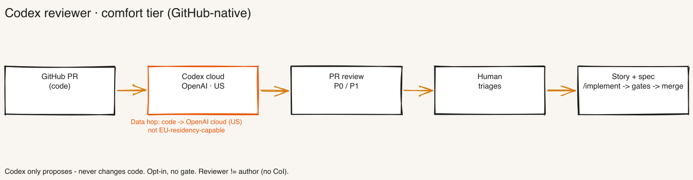
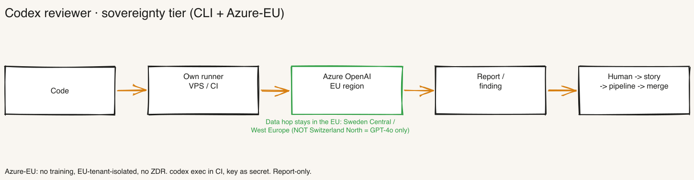

# Codex reviewer — independent code review as an opt-in layer (runbook)

[🇩🇪 Deutsch](./codex-reviewer.md) · [🇬🇧 English](./codex-reviewer.en.md)

> **Purpose:** Put an **independent code reviewer** into production — deliberately a *different* tool than the author (Claude): **Codex** (OpenAI). It checks code quality from a senior-developer perspective and **only proposes** — it never changes code itself. Opt-in, **no gate**. Source/decision: BOO-239 (operator 2026-06-20/22, verified research).
>
> **Last updated:** 2026-06-23

---

## What it is — and what it is not

- **An independent second review pass.** Codex is deliberately a **different tool than the author** (Claude). Reviewer ≠ author → **no conflict of interest** (CoI control, cf. four-eyes BOO-150, human-in-the-lead BOO-227).
- **Report-only, no auto-fix.** Codex **never changes code** (no "apply"); it returns only a **finding/report**. The fix runs through the normal pipeline (see [findings flow](#findings-flow--from-finding-to-fix)).
- **Opt-in, no hard gate.** Deliberately no blocking barrier — there are already enough deterministic gates (Semgrep/Sonar/coverage in `/implement`), and an extra LLM pass costs tokens. Codex complements those gates with a **senior-dev look from a different vendor** and catches what the gates miss (design, craft, edge cases).
- **A triggered routine, not a standing agent.** Trigger → Codex reviews → proposes → human decides. **Not** a self-triggering perpetual agent (boundary to BOO-225/BOO-230).
- **No MCP server, no Claude review skill.** Build-vs-buy (ADR-1): **Codex = engine**, the framework provides only **contract + wiring** (AGENTS.md guidelines + this runbook). A Claude review skill would be the author reviewing itself (CoI) — deliberately not built.

## Two operating tiers — reviewer tier follows repo tier

There are two paths, depending on the data-sovereignty requirement. **Rule: you do not decide this twice — the reviewer tier follows the repo tier.** 80/20: **GitHub is the standard.**

| | **Comfort tier (standard, 80%)** | **Sovereignty tier (EU/CH)** |
|---|---|---|
| When | GitHub repo, GitHub-US is fine | EU/CH data residency required |
| Mechanism | Native Codex cloud PR review (`@codex review` / auto toggle) | Codex **CLI self-operated** (GitHub runner or own VPS) against **Azure OpenAI EU region** |
| Data hop | Code → **OpenAI cloud (US)** | Code → **own runner → Azure-EU** |
| Setup effort | low (workflow template) | medium (CLI + Azure tenant + key) |
| Result location | GitHub PR review comment (P0/P1) | Report / Linear finding |

**Important:** The **native** cloud PR review runs fixed in the OpenAI/ChatGPT cloud (US) — **no region choice, not EU-residency-capable**. Anyone needing EU/CH residency **cannot** use the native review and must run the sovereignty tier (CLI + Azure-EU). For GitHub-US customers the VPS path gives **no result advantage** — only operational reasons.

---

## Tier 1 — comfort: native GitHub PR review

The fastest path when the repo lives on GitHub and GitHub-US (OpenAI cloud US) is acceptable.



1. **Enable** — turn on the native Codex GitHub integration: either **auto-review** for PRs or on demand with `@codex review` as a PR comment. Codex posts its finding as a **GitHub review** (with P0/P1 priorities).
2. **Workflow template** — alternatively wire it as a GitHub Action (`openai/codex-action@v1`) so the review runs as a CI step per PR.
3. **Guidelines** — Codex reads the **`AGENTS.md`** review guidelines (applied by the review runner, 3-level resolution, max 32 KiB) and checks **against the project artifacts** instead of generically (see [AGENTS.md guidelines](#agentsmd--the-review-contract)).
4. **Make the data hop explicit** — the code goes into the **OpenAI cloud (US)**. Consistent with a GitHub-US repo, but **not** EU-residency-capable.

> **Alternatives in the comfort tier:** native `@codex review` (inline in the PR) and the **Codex app automations inbox**. There is also an official **Linear integration** (`@Codex` in the issue → cloud task → comment + PR link, since Dec 2025). **No** email path.

---

## Tier 2 — sovereignty: Codex CLI against Azure OpenAI EU

For EU/CH data residency. The native cloud review is off the table (not EU-capable) — instead **Codex CLI self-operated** (GitHub runner or own VPS, cf. runbook `headless-vps.en.md`) against an **Azure OpenAI EU region**.



**Endpoint control (`~/.codex/config.toml`):**

```toml
model_provider = "azure"
model = "gpt-5-codex"

[model_providers.azure]
name = "azure"
base_url = "https://<RESOURCE>.openai.azure.com/openai/v1"
# Auth via API key (as a secret/env var, NEVER in the repo)
```

- **Choose a region (gpt-5-codex available):** **West Europe** (NL), **Germany West Central**, **Sweden Central**.
- **⚠️ Switzerland North = GPT-4o only → unsuitable** for the Codex reviewer. If CH residency is *mandatory*, fall back to another EU region (West Europe / Sweden Central) or accept that gpt-5-codex is not available in CH.
- **Binary note:** the npm **musl** binary has an Azure DNS problem → use the **GNU binary** (or Homebrew install).
- **Known limit:** Entra ID / managed identity is **not yet** supported — auth runs via API key.
- **Run in CI:** `codex exec` non-interactively in the CI step; key as a CI secret. The finding comes back as a **report/Linear finding**.

**Residency assurances (Azure-EU):** no training on the data, EU-tenant-isolated, no ZDR caveat. Data hop: code → **own runner → Azure-EU** (does not leave the EU).

> **Provider map (verified 2026-06-22):** **Vertex** carries no OpenAI frontier/Codex models (only `gpt-oss`) — unsuitable for this reviewer. **Bedrock** is GA (since 2026-06-01) but **US-only**. So **Azure-EU** is the only EU-residency-capable path for gpt-5-codex.

---

## Reviewer contract

- **Perspective:** senior-developer review — design, craft, edge cases, maintainability. Not what the deterministic gates already cover.
- **Scope:** the PR diff (comfort) or the state handed to the CI run (sovereignty), checked **against** SECURITY.md, ARCHITECTURE_DESIGN.md and CONVENTIONS.md via the AGENTS.md guidelines.
- **Cadence:** per PR (comfort) and/or via cron (sovereignty/daily bug scanner, see `daily-bug-scanner.en.md`).
- **Output:** a **finding/report** — no patch, no merge.
- **Dedup:** already-reported findings are deduplicated via `memory.md` (pattern from BOO-241).

## Findings flow — from finding to fix

**Codex never changes code.** The path from finding to fix runs through the normal governance pipeline — so the *fix* passes the gates, not a raw Codex patch, and everything **stays in the framework**:

1. **Codex proposes** → finding as a report (comfort: GitHub PR review comment; sovereignty: report/Linear finding).
2. **Human triages** → is it a real finding?
3. **Real finding → backlog story + spec.**
4. **Normal pipeline:** `/implement` → gates → PR → **human merge** (no auto-fix, no auto-merge, cf. BOO-227).

## AGENTS.md — the review contract

Codex reviews **against the project contract**, not generically. The review guidelines live in the **`AGENTS.md`** block (CLAUDE.md counterpart for Codex) and are applied by the review runner (3-level resolution, max 32 KiB). The template lives in `bootstrap/references/file-templates.md` (section "AGENTS.md") and is generated at bootstrap; existing projects pull it via `migrate_boo_239`. The block points to SECURITY.md, ARCHITECTURE_DESIGN.md and CONVENTIONS.md as the yardstick.

## Boundary

- **vs. `/architecture-review` (Claude, framework-internal):** that is the framework's own review **by the author**. Codex is the **independent second pass from a different vendor** (CoI). Complementary, not a replacement.
- **vs. BOO-230 (auditor):** the auditor checks **process/conformance** (ISO-27001-like). BOO-239 checks **code craft**. Two different things.
- **vs. the deterministic gates (`/implement`):** Semgrep/Sonar/coverage are rule-based. Codex is the **LLM senior-dev pass** that catches design/edge cases rules cannot see.
- **vs. `daily-bug-scanner.en.md`:** that is the **cron automation variant** of the same reviewer (triggered job instead of PR trigger). This runbook is the overarching opt-in layer; the `.toml` mechanics live there.

## References

- Spec: `specs/BOO-239.md` · HANDBUCH **Appendix AU** (concept) · **Appendix J/K** (Codex onboarding as runtime)
- Related: `daily-bug-scanner.en.md` (cron variant) · BOO-150 (four-eyes) · BOO-227 (human-in-the-lead) · BOO-241 (scanner doc/dedup)
- Surfacing: post-install "optional add-ons" (bootstrap §7.7, HANDBUCH Appendix AT, BOO-248)
- Sources verified 2026-06-22: native GitHub review (no region choice) · Codex CLI against Azure · Azure region status (Switzerland North = GPT-4o) · Vertex (gpt-oss only) · Bedrock (US-only, GA 2026-06-01).
