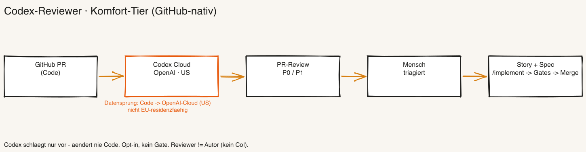
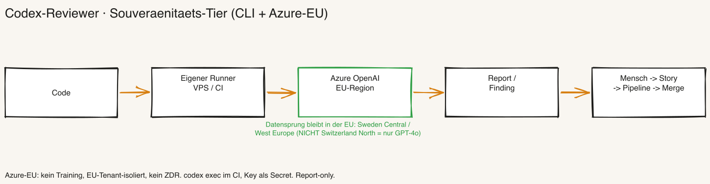

# Codex-Reviewer — unabhängiger Code-Review als Opt-in-Layer (Runbook)

[🇩🇪 Deutsch](./codex-reviewer.md) · [🇬🇧 English](./codex-reviewer.en.md)

> **Zweck:** Einen **unabhängigen Code-Reviewer** produktiv schalten — bewusst ein *anderes* Tool als der Autor (Claude): **Codex** (OpenAI). Es prüft die Codequalität aus Senior-Developer-Sicht und **schlägt nur vor** — es ändert nie selbst Code. Opt-in, **kein Gate**. Quelle/Entscheid: BOO-239 (Operator 2026-06-20/22, verifizierte Recherche).
>
> **Zuletzt aktualisiert:** 2026-06-23

---

## Was es ist — und was nicht

- **Unabhängiger zweiter Review-Pass.** Codex ist bewusst ein **anderes Tool als der Autor** (Claude). Reviewer ≠ Autor → **kein Interessenkonflikt** (CoI-Control, vgl. Vier-Augen BOO-150, Human-in-the-Lead BOO-227).
- **Report-only, kein Auto-Fix.** Codex **ändert nie Code** (kein „apply"), es liefert nur einen **Befund/Report**. Die Behebung läuft durch die normale Pipeline (siehe [Findings-Flow](#findings-flow--vom-befund-zur-behebung)).
- **Opt-in, kein Hard Gate.** Bewusst keine blockierende Schranke — es gibt schon genug deterministische Gates (Semgrep/Sonar/Coverage in `/implement`), und ein zusätzlicher LLM-Pass kostet Token. Codex ergänzt diese Gates um einen **Senior-Dev-Blick von einem anderen Anbieter** und fängt, was die Gates nicht fangen (Design, Handwerk, Edge-Cases).
- **Eine getriggerte Routine, kein stehender Agent.** Auslöser → Codex reviewt → schlägt vor → Mensch entscheidet. **Kein** selbst-auslösender Dauer-Agent (Abgrenzung zu BOO-225/BOO-230).
- **Kein MCP-Server, kein Claude-Review-Skill.** Build-vs-Buy (ADR-1): **Codex = Engine**, das Framework liefert nur **Vertrag + Verdrahtung** (AGENTS.md-Guidelines + dieses Runbook). Ein Claude-Review-Skill wäre wieder der Autor, der sich selbst reviewt (CoI) — bewusst nicht gebaut.

## Zwei Betriebs-Tiers — Reviewer-Tier folgt Repo-Tier

Es gibt zwei Wege, je nach Datensouveränitäts-Anspruch. **Regel: Man entscheidet das nicht zweimal — der Reviewer-Tier folgt dem Repo-Tier.** 80/20: **GitHub ist der Standard.**

| | **Komfort-Tier (Standard, 80 %)** | **Souveränitäts-Tier (EU/CH)** |
|---|---|---|
| Wann | GitHub-Repo, GitHub-US ist ok | EU/CH-Datenresidenz Pflicht |
| Mechanik | Native Codex-Cloud-PR-Review (`@codex review` / Auto-Schalter) | Codex-**CLI selbst betrieben** (GitHub-Runner oder eigener VPS) gegen **Azure OpenAI EU-Region** |
| Datensprung | Code → **OpenAI-Cloud (US)** | Code → **eigener Runner → Azure-EU** |
| Setup-Aufwand | gering (Workflow-Template) | mittel (CLI + Azure-Tenant + Key) |
| Ergebnis-Ort | GitHub-PR-Review-Kommentar (P0/P1) | Report / Linear-Finding |

**Wichtig:** Die **native** Cloud-PR-Review läuft fix in der OpenAI/ChatGPT-Cloud (US) — **keine Regionswahl, nicht EU-residenzfähig**. Wer EU/CH-Residenz braucht, kann die native Review **nicht** nutzen und muss den Souveränitäts-Tier (CLI + Azure-EU) fahren. Für GitHub-US-Kunden bringt der VPS-Weg **keinen Ergebnis-Vorteil** — nur Betriebs-Gründe.

---

## Tier 1 — Komfort: native GitHub-PR-Review

Der schnellste Weg, wenn das Repo auf GitHub liegt und GitHub-US (OpenAI-Cloud-US) akzeptabel ist.



1. **Aktivieren** — native Codex-GitHub-Integration einschalten: entweder **Auto-Review** für PRs oder on-demand mit `@codex review` als PR-Kommentar. Codex postet seinen Befund als **GitHub-Review** (mit P0/P1-Prioritäten).
2. **Workflow-Template** — alternativ als GitHub Action verdrahten (`openai/codex-action@v1`), damit der Review als CI-Schritt pro PR läuft.
3. **Guidelines** — Codex liest die **`AGENTS.md`**-Review-Guidelines (vom Review-Runner angewendet, 3-Stufen-Auflösung, max. 32 KiB) und prüft **gegen die Projekt-Artefakte** statt generisch (siehe [AGENTS.md-Guidelines](#agentsmd--der-review-vertrag)).
4. **Datensprung bewusst machen** — der Code geht in die **OpenAI-Cloud (US)**. Konsistent mit einem GitHub-US-Repo, aber **nicht** EU-residenzfähig.

> **Alternativen im Komfort-Tier:** native `@codex review` (inline im PR) und die **Codex-App-Automations-Inbox**. Es gibt zudem eine offizielle **Linear-Integration** (`@Codex` im Issue → Cloud-Task → Kommentar + PR-Link, seit Dez 2025). **Keine** E-Mail-Strecke.

---

## Tier 2 — Souveränität: Codex-CLI gegen Azure OpenAI EU

Für EU/CH-Datenresidenz. Die native Cloud-Review entfällt (nicht EU-fähig) — stattdessen **Codex-CLI selbst betrieben** (GitHub-Runner oder eigener VPS, vgl. Runbook `headless-vps.md`) gegen eine **Azure-OpenAI-EU-Region**.



**Endpunkt-Kontrolle (`~/.codex/config.toml`):**

```toml
model_provider = "azure"
model = "gpt-5-codex"

[model_providers.azure]
name = "azure"
base_url = "https://<RESOURCE>.openai.azure.com/openai/v1"
# Auth via API-Key (als Secret/Umgebungsvariable, NIE im Repo)
```

- **Region wählen (gpt-5-codex verfügbar):** **West Europe** (NL), **Germany West Central**, **Sweden Central**.
- **⚠️ Switzerland North = nur GPT-4o → ungeeignet** für den Codex-Reviewer. Wer CH-Residenz *zwingend* braucht, fällt auf eine andere EU-Region zurück (West Europe / Sweden Central) oder akzeptiert, dass kein gpt-5-codex in CH verfügbar ist.
- **Binary-Hinweis:** Das npm-**musl**-Binary hat ein Azure-DNS-Problem → das **GNU-Binary** (bzw. Homebrew-Installation) verwenden.
- **Bekannte Grenze:** Entra ID / Managed Identity wird noch **nicht** unterstützt — Auth läuft über API-Key.
- **Lauf im CI:** `codex exec` non-interaktiv im CI-Schritt; Key als CI-Secret. Der Befund kommt als **Report/Linear-Finding** zurück.

**Residenz-Zusicherungen (Azure-EU):** kein Training auf den Daten, EU-Tenant-isoliert, kein ZDR-Vorbehalt. Datensprung: Code → **eigener Runner → Azure-EU** (verlässt die EU nicht).

> **Provider-Landkarte (verifiziert 2026-06-22):** **Vertex** führt keine OpenAI-Frontier-/Codex-Modelle (nur `gpt-oss`) — für diesen Reviewer ungeeignet. **Bedrock** ist GA (seit 2026-06-01), aber **US-only**. Damit ist **Azure-EU** der einzige EU-residenzfähige Weg für gpt-5-codex.

---

## Reviewer-Contract

- **Perspektive:** Senior-Developer-Review — Design, Handwerk, Edge-Cases, Wartbarkeit. Nicht das, was die deterministischen Gates schon abdecken.
- **Scope:** der PR-Diff (Komfort) bzw. der im CI-Lauf übergebene Stand (Souveränität), geprüft **gegen** SECURITY.md, ARCHITECTURE_DESIGN.md und CONVENTIONS.md via AGENTS.md-Guidelines.
- **Kadenz:** pro PR (Komfort) und/oder per Cron (Souveränität/Daily-Bug-Scanner, siehe `daily-bug-scanner.md`).
- **Output:** ein **Befund/Report** — kein Patch, kein Merge.
- **Dedup:** bereits gemeldete Funde werden über `memory.md` dedupliziert (Muster aus BOO-241).

## Findings-Flow — vom Befund zur Behebung

**Codex ändert nie Code.** Der Weg vom Befund zur Behebung läuft durch die normale Governance-Pipeline — so durchläuft die *Behebung* die Gates, nicht ein roher Codex-Patch, und alles **bleibt im Framework**:

1. **Codex schlägt vor** → Befund als Report (Komfort: GitHub-PR-Review-Kommentar; Souveränität: Report/Linear-Finding).
2. **Mensch triagiert** → ist es ein echtes Finding?
3. **Echtes Finding → Backlog-Story + Spec.**
4. **Normale Pipeline:** `/implement` → Gates → PR → **menschlicher Merge** (kein Auto-Fix, kein Auto-Merge, vgl. BOO-227).

## AGENTS.md — der Review-Vertrag

Codex reviewt **gegen den Projektvertrag**, nicht generisch. Die Review-Guidelines stehen im **`AGENTS.md`**-Block (CLAUDE.md-Pendant für Codex) und werden vom Review-Runner angewendet (3-Stufen-Auflösung, max. 32 KiB). Das Template liegt in `bootstrap/references/file-templates.md` (Abschnitt „AGENTS.md") und wird beim Bootstrap erzeugt; Bestandsprojekte ziehen es über `migrate_boo_239` nach. Inhaltlich verweist der Block auf SECURITY.md, ARCHITECTURE_DESIGN.md und CONVENTIONS.md als Prüf-Maßstab.

## Abgrenzung

- **vs. `/architecture-review` (Claude, framework-intern):** Das ist der framework-eigene Review **durch den Autor**. Codex ist der **unabhängige zweite Pass von einem anderen Anbieter** (CoI). Komplementär, nicht ersetzend.
- **vs. BOO-230 (Auditor):** Der Auditor prüft **Prozess/Konformität** (ISO-27001-artig). BOO-239 prüft **Code-Handwerk**. Zwei verschiedene Dinge.
- **vs. den deterministischen Gates (`/implement`):** Semgrep/Sonar/Coverage sind regelbasiert. Codex ist der **LLM-Senior-Dev-Pass**, der Design/Edge-Cases fängt, die Regeln nicht sehen.
- **vs. `daily-bug-scanner.md`:** Das ist die **Cron-Automations-Variante** desselben Reviewers (getriggerter Job statt PR-Trigger). Dieses Runbook ist der übergreifende Opt-in-Layer; die `.toml`-Mechanik steht dort.

## Verweise

- Spec: `specs/BOO-239.md` · HANDBUCH **Anhang AU** (Konzept) · **Anhang J/K** (Codex-Onboarding als Runtime)
- Verwandt: `daily-bug-scanner.md` (Cron-Variante) · BOO-150 (Vier-Augen) · BOO-227 (Human-in-the-Lead) · BOO-241 (Scanner-Doku/Dedup)
- Surfacing: Post-Install „Optionale Add-ons" (bootstrap §7.7, HANDBUCH Anhang AT, BOO-248)
- Quellen verifiziert 2026-06-22: native GitHub-Review (keine Regionswahl) · Codex-CLI gegen Azure · Azure-Region-Stand (Switzerland North = GPT-4o) · Vertex (nur gpt-oss) · Bedrock (US-only, GA 2026-06-01).
