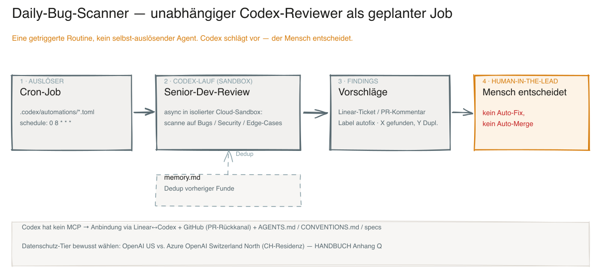

# Daily-Bug-Scanner — unabhängiger Codex-Reviewer als geplanter Job (Runbook)

[🇩🇪 Deutsch](./daily-bug-scanner.md) · [🇬🇧 English](./daily-bug-scanner.en.md)

> Wie der Daily-Bug-Scanner funktioniert und exakt gebaut ist. Kurz: ein **getriggerter Job**, der **Codex** (bewusst ein anderes Tool als der Autor) den Code aus Senior-Developer-Sicht reviewen lässt und Funde als Backlog-Tickets **vorschlägt**. Quelle: BOO-50. Die Produktisierung als benannter Opt-in-Governance-Layer ist **BOO-239**.

## Was es ist — und was nicht

- Eine **Routine / ein Job**, **kein** selbst-auslösender Agent: ein **Auslöser** (Cron) stösst **Codex** an; Codex reviewt und **schlägt vor**. Der Mensch entscheidet. **Kein Auto-Fix, kein Auto-Merge** (Human-in-the-Lead, vgl. [Unsere Position](../../README.md#unsere-position-sequenzielle-pipeline-menschlich-freigegebene-merges)).
- Codex ist bewusst ein **anderes Tool als der Autor** (Claude) → kein Interessenkonflikt (Reviewer ≠ Autor; vgl. BOO-239, Vier-Augen BOO-150).

## Mechanik (end-to-end)

1. **Auslöser** — Cron-Zeitplan im `.codex/automations/<name>.toml` (`schedule`).
2. **Prompt-Vertrag** — „täglicher Code-Reviewer: scanne auf kritische Bugs/Security/Edge-Cases".
3. **Codex-Lauf** — async in einer isolierten Cloud-Sandbox.
4. **Dedup** — liest `memory.md` für bereits gemeldete Funde.
5. **Rückgabe** — neue Funde als Backlog-Ticket (Label, z.B. `autofix`) bzw. PR; Report „X gefunden, Y Duplikate".

## Die `.toml` erklärt

```toml
[automation]
name = "Daily Bug-Scanner"
cwd = "{{PROJECT_PATH}}"
schedule = "0 8 * * *"          # Cron: täglich 08:00

[prompt]
content = """
Täglicher Code-Reviewer für {{PROJECT_NAME}}: scanne auf kritische Bugs/Security/Edge-Cases,
prüfe ob ein Backlog-Ticket (Label: autofix) existiert, lege bei neuen Funden eines an
(Titel, betroffene Dateien als absolute Pfade, Impact, Repro, Suggested Fix, Format specs/TEMPLATE.md).
Lies {{ABSOLUTE_MEMORY_PATH}}/memory.md für vorherige Funde. Report: X gefunden, Y Duplikate.
"""
```

| Feld | Bedeutung |
|---|---|
| `name` | Anzeigename der Automation |
| `cwd` | Arbeitsverzeichnis (Projekt-Pfad) |
| `schedule` | Cron-Ausdruck (Auslöser) |
| `prompt.content` | der Reviewer-Auftrag (Senior-Dev-Perspektive + Dedup + Output-Format) |

## Anbindung (Codex hat **kein** MCP)

Codex wird **nicht** über MCP angebunden, sondern über: **Linear↔Codex-Integration** (`@Codex` im Issue), **GitHub** (PR als Rückkanal) und **Datei-Kontext** (`AGENTS.md` / `CONVENTIONS.md` / `specs/`). (MCP nutzt im Framework Claude — Linear/Obsidian/Grafana/Miro.)

## Setup

1. **Linear → Settings → Integrations → Codex → Connect GitHub.**
2. **GitHub-Auth** für Codex einrichten.
3. **`$CODEX_HOME`-Workaround:** absoluten `memory.md`-Pfad in der `.toml` setzen.

## Datenschutz / Souveränität

Der Reviewer liest viel (potenziell allen) Code → Tier **bewusst** wählen: **OpenAI Standard** (US, Commercial Terms) vs. **Azure OpenAI Switzerland North** (CH-Residenz, kein Training). Siehe HANDBUCH **Anhang Q** (Souveränitäts-Stack).

## Grenzen

- **Kein Auto-Fix / Auto-Merge** — der Scanner schlägt nur vor (Human-in-the-Lead).
- **Bekannte Lücke:** die lokale Codex-Hook-Enforcement (Pre-Commit/Gates) ist im Repo nicht dokumentiert (kein Schema/Beispiel). Die **CI-Schicht (Layer 3)** greift aber commit-agnostisch auch für Codex.

## Verwandt

HANDBUCH **Anhang J** (Codex-Onboarding, mit diesem Scanner als optionalem Beispiel) · **Anhang Q** (Souveränität) · **BOO-239** (Produktisierung als Opt-in-Layer „Independent Reviewer") · **BOO-50** (Quelle).

## Visualisierung



*Quelle: [`daily-bug-scanner.excalidraw`](../daily-bug-scanner.excalidraw). Eine getriggerte Routine — Codex schlägt vor, der Mensch entscheidet (kein Auto-Fix / Auto-Merge).*
